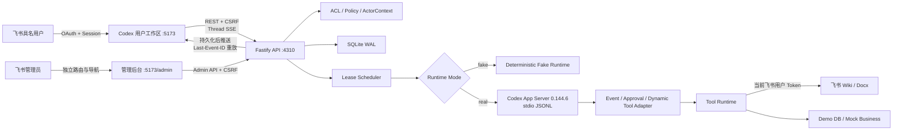
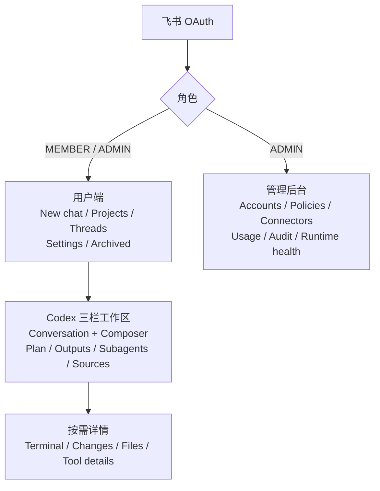
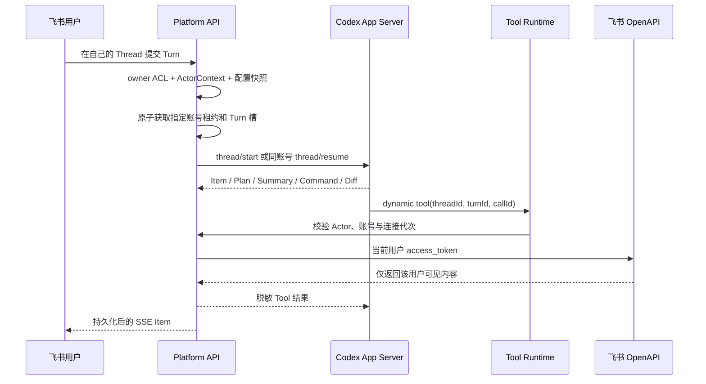
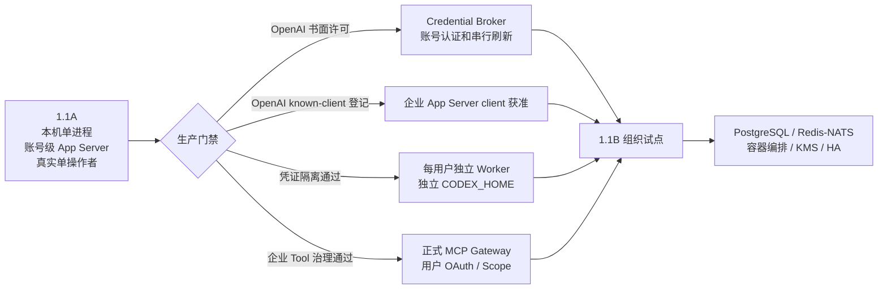

# 架构与数据流

## 目标与部署边界

CodexPlatform 1.1 的产品边界是“员工 Codex 工作区 + 独立管理后台”，技术边界分为两段：

- **1.1A 当前实现**：单台 Mac、loopback、Fastify + React + SQLite、单进程 API、账号级长期 App Server。真实 Codex 仅允许首位管理员单操作者使用。
- **1.1B 规划**：每位内部用户独立 Worker 和 `CODEX_HOME`，账号级 Credential Broker、正式 MCP Gateway、PostgreSQL、消息总线、KMS 和 HA。

当前仓库不包含容器集群、独立系统用户、分布式租约或生产密钥托管，不能把 1.1B 架构图视为已交付能力。

## 1.1A 总体架构



### 模块职责

| 模块 | 1.1A 当前职责 |
| --- | --- |
| `apps/web` | 飞书登录、CODEX-only 用户工作区、连续 Thread、Settings、Subagents 可观测面、独立管理后台 |
| `apps/api/src/auth` | 飞书 OAuth、租户校验、用户/Session、Token 刷新 |
| `apps/api/src/domain` | Project/Thread/Turn/Item 投影、用户设置、审批、账号状态、租约、排队、用量与审计 |
| `apps/api/src/infra/codex` | JSONL RPC、账号级 App Server、协议类型、Thread/Turn/Item/Subagent 事件规范化 |
| `apps/api/src/tools` | `ActorContext` 绑定、飞书只读 Tool、安全 Demo SQL、Mock 业务 Tool |
| `apps/api/src/security` | AES-GCM Token 加密、运行环境白名单和 Codex 凭证隔离探针 |
| `packages/contracts` | CODEX bootstrap、Thread/Turn/Item、Settings、Subagent、用量和事件 DTO |

## 用户端与管理后台

用户端和管理后台共享登录态与后端，但不共享信息架构：



- 普通用户只能访问自己的 Project、Thread、Turn、Item、审批、Settings 和企业连接状态。
- 管理员可以从用户端进入独立管理后台，但管理页面不嵌入个人 Settings。
- 1.1A 的 Users/Roles 目录、生产 Worker 管理和完整插件目录尚未接入，页面会明确显示不可用。
- `GET /api/bootstrap` 当前只返回 `enabledModes: ["CODEX"]`；ChatGPT Chat / Work 没有 Runtime，因此不显示入口。

## 核心信息模型

```text
Tenant
 └─ User
     ├─ UserSettings
     ├─ UserConnection
     └─ Project
         └─ Thread
             ├─ Turn
             │   ├─ EffectiveThreadConfigSnapshot
             │   └─ Item
             └─ SubagentThread
                 └─ Item
```

### Project → Thread → Turn → Item

- `Project` 组织 Thread。
- `Thread` 是用户可连续使用的任务上下文，对原 Codex 账号和 `CODEX_HOME` 保持粘性。
- `Turn` 保存本次 Prompt、状态、时间和不可变配置快照。
- `Item` 是消息、Plan、推理摘要、命令、Tool、Diff、审批、Subagent 活动、Token 用量或结果。
- `SubagentThread` 是父 Thread/Turn 下的独立可观测线程，保存 Active/Done 状态、摘要、事件和用量。

数据库仍保留早期 `tasks` / `task_events` 命名以兼容迁移；对外 1.1 API 和产品语义已经使用 Thread/Turn/Item。旧 `/tasks/:id` URL 仅作为兼容入口，重定向到 `/threads/:id`。

### 主要用户 API

```text
GET  /api/bootstrap
GET  /api/projects
POST /api/projects
GET  /api/threads
POST /api/threads
GET  /api/threads/:id
POST /api/threads/:id/turns
POST /api/threads/:id/steer
POST /api/threads/:id/interrupt
GET  /api/threads/:id/events
GET  /api/threads/:id/subagents
GET  /api/subagents/:threadId
GET  /api/me/settings
PATCH /api/me/settings
GET  /api/me/usage
GET  /api/me/connections
GET  /api/me/plugins
```

## Settings 与有效配置

Settings 归属于飞书用户，不写入共享 Codex 账号目录。当前实现边界是：

- General：语言、主题、默认 Project、通知均可持久化；只有默认 Project 已接入 New chat 流程，语言、主题和通知尚未全局生效。
- Profile：飞书身份与角色只读展示。
- Execution：Reasoning Effort、权限模式和固定为 `ASK` 的审批偏好进入有效配置；模型目录未接入，因此模型选择保持禁用。
- Personalization：Personality 和个人 Instructions 会进入有效配置。
- Connections 与 Usage：只读用户视图。
- Plugins：返回管理员批准目录的接口已保留，1.1A 目录为空且不允许安装。
- Archived chats：仅保留导航与空状态，归档数据流尚未实现。

1.1A 当前生效配置按以下顺序合并：

```text
组织强制约束
  → 组织默认值
  → 用户 Settings
  → Thread override
  → Turn override
  → EffectiveThreadConfigSnapshot
```

任何覆盖都不能突破组织策略。每个 Turn 保存不可变快照，后续修改个人 Settings 不会改写历史。Project 级执行设置和完整组织策略编辑是后续能力，当前不宣称已经生效。

## 身份、共享账号与 Tool 权限

系统存在两种不能互相替代的身份：

1. 飞书用户身份决定登录、资源 ACL、Settings、企业连接和 Tool 可访问内容。
2. Codex 账号身份只提供模型认证和共享额度。



`ActorContext` 缺失、Thread/Turn 不匹配、连接代次过期或子 Thread 所有者冲突时，Tool 请求 fail closed。共享 Codex 账号不会授予任何飞书或业务系统权限。

## 调度、账号粘性与排队

账号预选不占槽；提交 Turn 时才在 SQLite `BEGIN IMMEDIATE` 事务中获取资源：

- 每个账号最多 4 个不同用户槽。
- 同一用户在同一账号复用一个用户槽，最多同时运行 2 个 Turn。
- 第 5 名用户或同用户第 3 个 Turn 进入单调递增队列。
- 新 Thread 按周额度剩余、活跃用户数、健康度、最久未分配和账号 ID 稳定排序。
- 已有 Thread 通过 `requiredAccountId` 固定到原账号；排队项也持久化该约束，不能切换到其他高额度账号。
- 排队提升会选择最早的可运行项，避免不可用账号上的队首阻塞其他账号；新请求不能越过更早且可运行的兼容等待项。
- Turn 终态立即释放 Turn 槽；用户没有运行 Turn 后，用户槽保留到 30 分钟空闲超时。

账号必须处于可分配状态、已认证、健康且有新鲜额度。没有精确 7 天额度桶时记录 `WEEKLY_QUOTA_UNKNOWN`；当前默认不放行。

## Runtime 与恢复边界

### fake

`fake` 使用真实登录、数据、ACL、调度、事件和 UI，但产生确定性的 Plan、命令、Tool、Diff 和结果。它不会启动 Codex App Server，也不会调用真实飞书 Tool。因此 fake 可以验证产品和调度，不能证明真实凭证隔离或真实外部链路。

### real

1.1A 为每个 Codex 账号维护一个长期 App Server 进程和一个账号级 `CODEX_HOME`：

- `@openai/codex@0.144.6`
- `app-server --stdio --strict-config`
- `cli_auth_credentials_store="file"`
- `approvalPolicy: on-request`
- `sandbox: workspace-write`

使用 `thread/start/resume` 和 `turn/start/steer/interrupt`。协议类型锁定在仓库中，通过 `pnpm codex:verify-protocol` 检查漂移。

### active Turn fail closed

恢复旧 Thread 时，只有满足以下条件才允许启动新 Turn：

1. Thread 状态明确为 idle。
2. 返回的每个 Turn 状态都能识别。
3. 所有已有 Turn 都是已知终态。

若返回 active/in-progress、未知、Malformed、`notLoaded` 或 `systemError` 等无法证明安全的状态，1.1A 不会再次调用 `turn/start`。平台会：

1. 拒绝本次新 Prompt。
2. 停止并隔离对应账号 App Server。
3. 清除该账号的 Actor/审批运行绑定。
4. 将受影响任务标记为 `NEEDS_RECOVERY` 并释放调度槽。

这不是“接回原 Turn”。1.1A 没有活动 Turn 重新附着能力，也不会自动重放可能产生副作用的 Tool。

## Subagent 数据流

Codex App Server 的协作/子 Agent Item 会被规范化为 `SUBAGENT_ACTIVITY`。平台：

- 继承父 Turn 的飞书用户 `ActorContext` 和 Tool Scope。
- 持久化父子 Thread 关系、状态、耗时、结果摘要、独立 Item 和 Token 用量。
- 在用户端按 Active/Done 展示，并允许打开独立只读详情。
- 将 Token 用量按用户拥有的 Thread 树归集；共享账号额度不会伪装成可精确归因到个人。

1.1A 没有伪造“直接停止任意子 Agent”的接口，也未交付完整的组织级 Subagent 并发/预算执行器；控制仍通过父 Turn 的 Interrupt/Steer 边界完成。

## SSE、投影与敏感数据

Item 先写入 SQLite，再通过 `/api/threads/:id/events` 推送。断线后客户端携带 `Last-Event-ID`，后端只重放更大 sequence：

- 增量仅在相同 `threadId + turnId + itemId + type` 内合并。
- 缺少稳定 Item 边界时不跨 Item 猜测合并。
- SSE 在 Session 到期/撤销时关闭，所有历史与实时读取都执行 owner ACL。
- 用户端 Thread、旧 Task 兼容响应和实时 SSE 会移除账号别名、租约、transport identity、原始审批 RPC ID 和 Runtime Turn ID 等敏感运行标识；Subagent Thread ID 与部分 Item ID 仍作为受 owner ACL 保护的工作流关联标识返回。
- `reasoning.summary` 可作为“执行思路”显示，但不属于审计证据。
- `reasoningTextDelta`、原始 `content`、`encrypted_content`、凭证、租约 ID 和原始审批 RPC ID 不会进入用户浏览器。
- 管理员审计可保留账号别名以支持责任追踪，但仍不返回凭证或 `CODEX_HOME`。

## 1.1B 演进



1.1B 的共享范围仅是模型凭证与账号额度。Thread、Settings、Connection、文件、插件状态、Memory 和 Tool 身份都必须按 `tenant + user` 隔离。

1.1A real Runtime 已在每次新建或恢复 Thread 后、启动 Turn 前强制调用
`thread/memoryMode/set { mode: "disabled" }`。该调用或响应校验失败会触发账号级
fail-closed 恢复；它降低共享 Home 的原生 Memory 串用风险，但不能替代 1.1B
的独立 Worker、独立 `CODEX_HOME` 和跨用户哨兵验收。

## Tool 范围

| Tool | 数据源 | 1.1A 限制 |
| --- | --- | --- |
| `feishu_wiki_search` | 真实飞书搜索 | 当前用户 Token；只读 |
| `feishu_doc_read` | 真实 Wiki/Docx | 当前用户 Token；只读文本块和引用 |
| `demo_db_query` | 本地 Demo SQLite | 单条 allowlist `SELECT`，最多 100 行、256 KiB |
| `demo_business_get` | 确定性 Mock | 仅 `order` / `customer`，不是实际业务系统 |

Dynamic Tools 是 1.1A 的锁版本过渡适配层。生产版计划替换为正式 MCP Gateway。所有企业外部写操作在当前 MVP 中均未接入。
