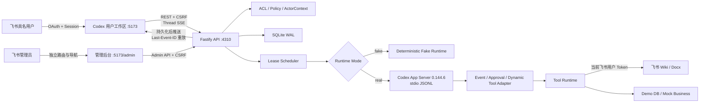
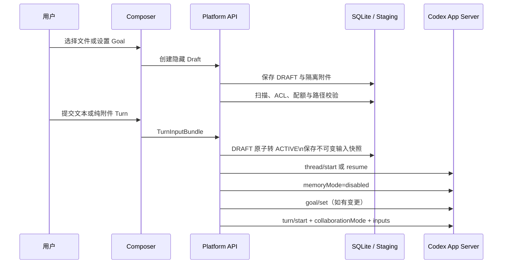
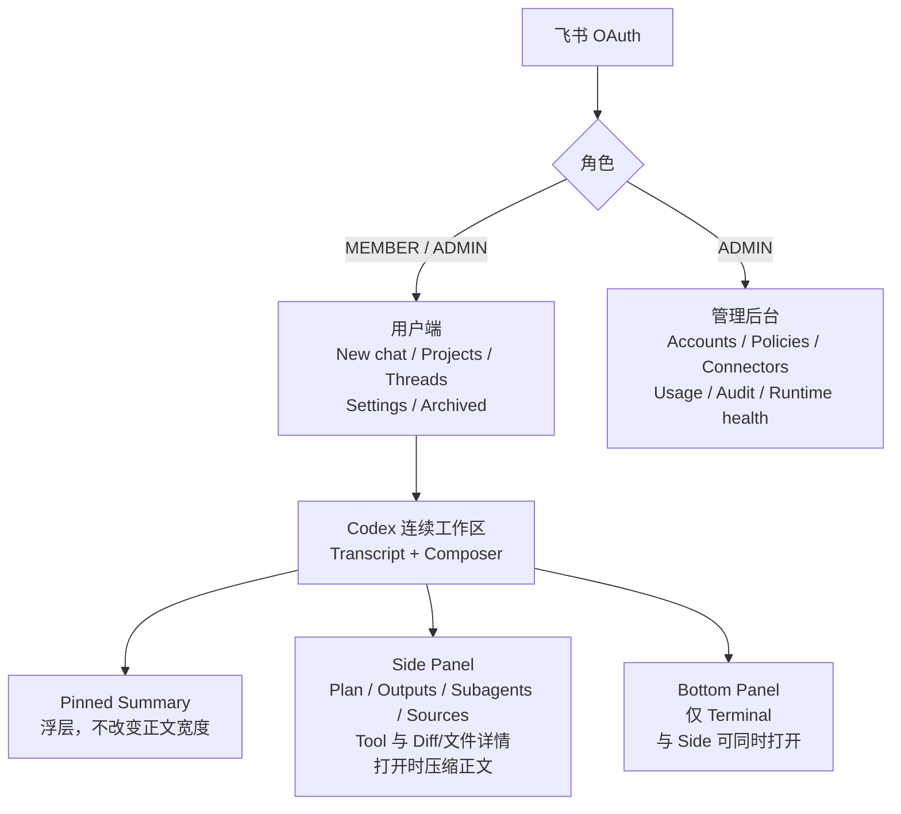
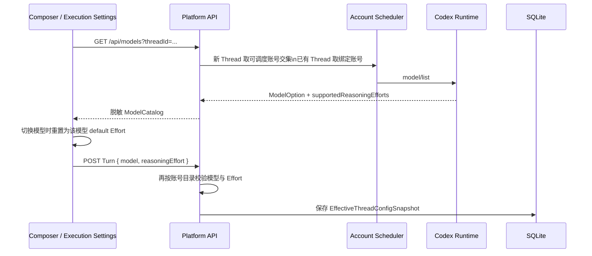
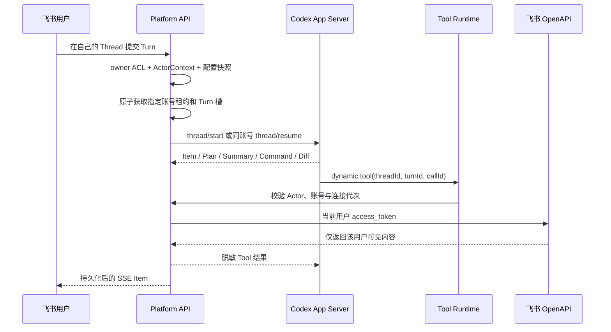
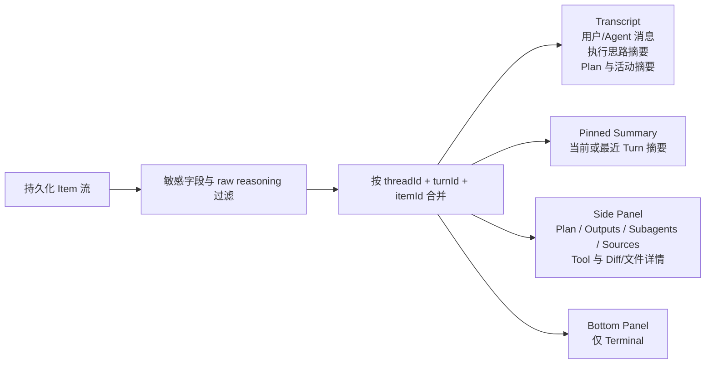
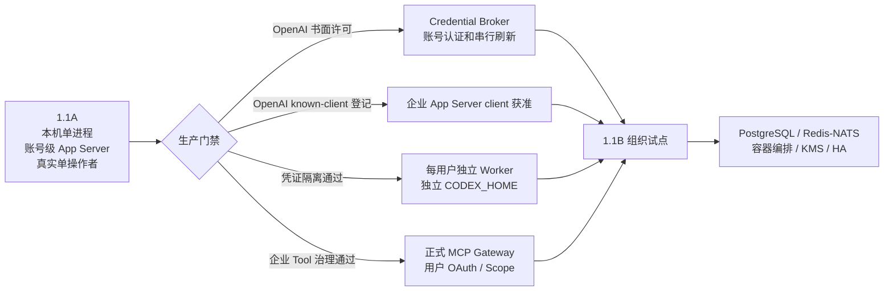

# 架构与数据流

## 目标与部署边界

CodexPlatform 1.1 的产品边界是“员工 Codex 工作区 + 独立管理后台”，技术边界分为两段：

- **1.1A 当前实现**：单台 Mac、loopback、Fastify + React + SQLite、单进程 API、账号级长期 App Server。真实 Codex 仅允许首位管理员单操作者使用。
- **1.1B 规划**：每位内部用户独立 Worker 和 `CODEX_HOME`，账号级 Credential Broker、正式 MCP Gateway、PostgreSQL、消息总线、KMS 和 HA。

当前仓库不包含容器集群、独立系统用户、分布式租约或生产密钥托管，不能把 1.1B 架构图视为已交付能力。

## 1.1A 总体架构



### 模块职责

| 模块 | 1.1A 当前职责 |
| --- | --- |
| `apps/web` | 飞书登录、CODEX-only 用户工作区、Transcript 投影、三个独立工作表面、模型/Effort 选择、Settings、Subagents 可观测面、独立管理后台 |
| `apps/api/src/auth` | 飞书 OAuth、租户校验、用户/Session、Token 刷新 |
| `apps/api/src/domain` | Project/Thread/Turn/Item 投影、用户设置、审批、账号状态、租约、排队、用量与审计 |
| `apps/api/src/infra/codex` | JSONL RPC、账号级 App Server、协议类型、Thread/Turn/Item/Subagent 事件规范化 |
| `apps/api/src/tools` | `ActorContext` 绑定、飞书搜索/读取/受控 Docx 写 Tool、安全 Demo SQL、Mock 业务 Tool |
| `apps/api/src/security` | AES-GCM Token 加密、运行环境白名单和 Codex 凭证隔离探针 |
| `packages/contracts` | CODEX bootstrap、Thread/Turn/Item、Settings、Subagent、用量和事件 DTO |

## Composer Draft、附件、Goal 与 Plan



- 隐藏 Draft 使用 `DRAFT → ACTIVE | EXPIRED` 生命周期，不进入用户历史列表。
- 附件只存入 `<RUNTIME_DATA_DIR>/workspaces/<threadId>/.codexplatform/attachments/<attachmentId>/`；
  目录为 `0700`、文件为 `0600`，浏览器永远不获得服务器绝对路径。
- 单个附件根最多 50 MiB，单 Turn 200 MiB、32 个附件根、目录最多 500 个文件；不自动解压。
- Goal 原生 Token 预算与平台 60 分钟 Watchdog 同时生效；预算到达后暂停，不自动重复外部副作用。
- Plan mode 为 Thread sticky，使用锁定协议中的 collaboration preset；能力探测失败时拒绝启用。
- Plan Adapter 同时接收增量 Plan 事件和最终 Agent Message 中的
  `<proposed_plan>...</proposed_plan>`，归一化为可重放 `PROPOSED_PLAN_PUBLISHED` Item；标签本身
  不进入 Agent 正文，右侧 Plan 使用独立 Markdown 投影。锁定版本对部分最终 Plan 只发送
  `rawResponseItem/completed`，因此 `thread/start` 显式开启 `experimentalRawEvents`；Normalizer
  仅接收最终 assistant `output_text`，丢弃 Raw reasoning、加密内容和未知 Item。
- App Server 某些传输通知中的 Turn ID 与 `turn/start` 返回的规范 ID 可能不同。Adapter 以
  `turn/start` 返回值作为根 Turn 的 canonical identity；平台仅在任务存在唯一活跃 Turn 时对缺失
  identity 做安全回填，确保完成事件原子释放槽位并结束计时。

## 用户端与管理后台

用户端和管理后台共享登录态与后端，但不共享信息架构：



- 普通用户只能访问自己的 Project、Thread、Turn、Item、审批、Settings 和企业连接状态。
- 管理员可以从用户端进入独立管理后台，但管理页面不嵌入个人 Settings。
- Pinned Summary、Side Panel、Bottom Panel 使用独立状态；关闭任意一个不会连带关闭另外两个。它们不是同一个 Panel 的三种展示形态。
- 1.1A 的 Users/Roles 目录、生产 Worker 管理和完整插件目录尚未接入，页面会明确显示不可用。
- `GET /api/bootstrap` 当前只返回 `enabledModes: ["CODEX"]`；ChatGPT Chat / Work 没有 Runtime，因此不显示入口。

## 核心信息模型

```text
Tenant
 └─ User
     ├─ UserSettings
     ├─ UserConnection
     └─ Project
         └─ Thread
             ├─ Turn
             │   ├─ EffectiveThreadConfigSnapshot
             │   └─ Item
             └─ SubagentThread
                 └─ Item
```

### Project → Thread → Turn → Item

- `Project` 组织 Thread。
- `Thread` 是用户可连续使用的任务上下文，对原 Codex 账号和 `CODEX_HOME` 保持粘性。
- `Turn` 保存本次 Prompt、状态、时间和不可变配置快照。
- `Item` 是消息、Plan、推理摘要、命令、Tool、Diff、审批、Subagent 活动、Token 用量或结果。
- `SubagentThread` 是父 Thread/Turn 下的独立可观测线程，保存 Active/Done 状态、摘要、事件和用量。

数据库仍保留早期 `tasks` / `task_events` 命名以兼容迁移；对外 1.1 API 和产品语义已经使用 Thread/Turn/Item。旧 `/tasks/:id` URL 仅作为兼容入口，重定向到 `/threads/:id`。

### 主要用户 API

```text
GET  /api/bootstrap
GET  /api/projects
POST /api/projects
GET  /api/threads
POST /api/threads
POST /api/threads/drafts
GET  /api/threads/:id
DELETE /api/threads/:id/draft
POST /api/threads/:id/attachments
DELETE /api/threads/:id/attachments/:attachmentId
GET /api/threads/:id/goal
PUT /api/threads/:id/goal
PATCH /api/threads/:id/goal
DELETE /api/threads/:id/goal
PATCH /api/threads/:id/composer
POST /api/threads/:id/turns
POST /api/threads/:id/steer
POST /api/threads/:id/interrupt
GET  /api/threads/:id/events
GET  /api/threads/:id/subagents
GET  /api/subagents/:threadId
GET  /api/me/settings
PATCH /api/me/settings
GET  /api/me/usage
GET  /api/me/connections
GET  /api/me/plugins
```

## Settings 与有效配置

Settings 归属于飞书用户，不写入共享 Codex 账号目录。当前实现边界是：

- General：语言、主题、默认 Project、通知均可持久化；只有默认 Project 已接入 New chat 流程，语言、主题和通知尚未全局生效。
- Profile：飞书身份与角色只读展示。
- Execution：模型、Reasoning Effort、权限模式和固定为 `ASK` 的审批偏好进入有效配置；模型与 Effort 只能从当前 Runtime 模型目录选择。
- Personalization：Personality 和个人 Instructions 会进入有效配置。
- Connections 与 Usage：只读用户视图。
- Plugins：返回管理员批准目录的接口已保留，1.1A 目录为空且不允许安装。
- Archived chats：已支持 Thread 归档、归档列表、查看和恢复；归档只整理 CodexPlatform 历史，
  不修改 Codex App Server Thread。

1.1A 当前生效配置按以下顺序合并：

```text
组织强制约束
  → 组织默认值
  → 用户 Settings
  → Thread override
  → Turn override
  → EffectiveThreadConfigSnapshot
```

任何覆盖都不能突破组织策略。每个 Turn 保存不可变快照，后续修改个人 Settings 不会改写历史。Project 级执行设置和完整组织策略编辑是后续能力，当前不宣称已经生效。

### Runtime 模型目录与 Effort 联动

模型能力由运行账号的 App Server 返回，不在 Web 端维护静态模型常量：



- 新 Thread 使用所有当前可调度账号模型能力的安全交集，避免先选模型后调度到不支持的账号。
- 已绑定 Thread 只读取原账号目录，保持账号粘性。
- 切换模型时 Effort 自动回到新模型的默认值；用户只能再选择该模型明确支持的 Effort。
- 模型目录不可用、过期且刷新失败、账号被隔离或选择不再受支持时，提交 fail closed，不猜测模型名或沿用不兼容 Effort。
- Turn 的 `model`、`effort` 与完整有效配置快照共同持久化；UI 文案不是执行生效证据。

## 身份、共享账号与 Tool 权限

系统存在两种不能互相替代的身份：

1. 飞书用户身份决定登录、资源 ACL、Settings、企业连接和 Tool 可访问内容。
2. Codex 账号身份只提供模型认证和共享额度。



`ActorContext` 缺失、Thread/Turn 不匹配、连接代次过期或子 Thread 所有者冲突时，Tool 请求 fail closed。共享 Codex 账号不会授予任何飞书或业务系统权限。

## 调度、账号粘性与排队

运行模式边界：

- **1.1A Fake**：允许多人调度、四用户槽、双 Turn 和 FIFO 的确定性模拟。
- **1.1A Real**：共享账号 Runtime 仅允许指定 operator；多人真实执行仍被门禁拒绝。
- **1.1B Real**：取得书面许可并通过独立 Worker、独立 `CODEX_HOME`、Credential Broker 和跨
  用户哨兵后，才启用真实多人调度。

账号预选不占槽；提交 Turn 时才在 SQLite `BEGIN IMMEDIATE` 事务中获取资源：

- 每个账号最多 4 个不同用户槽。
- 同一用户在同一账号复用一个用户槽，最多同时运行 2 个 Turn。
- 第 5 名用户或同用户第 3 个 Turn 进入单调递增队列。
- 新 Thread 按周额度剩余、活跃用户数、健康度、最久未分配和账号 ID 稳定排序。
- 已有 Thread 通过 `requiredAccountId` 固定到原账号；排队项也持久化该约束，不能切换到其他高额度账号。
- 排队提升会选择最早的可运行项，避免不可用账号上的队首阻塞其他账号；新请求不能越过更早且可运行的兼容等待项。
- Turn 终态立即释放 Turn 槽；用户没有运行 Turn 后，用户槽保留到 30 分钟空闲超时。

账号必须处于可分配状态、已认证、健康且有新鲜额度。没有精确 7 天额度桶时记录 `WEEKLY_QUOTA_UNKNOWN`；当前默认不放行。

## Runtime 与恢复边界

### fake

`fake` 使用真实登录、数据、ACL、调度、事件和 UI，但产生确定性的 Plan、命令、Tool、Diff 和结果。它不会启动 Codex App Server，也不会调用真实飞书 Tool。因此 fake 可以验证产品和调度，不能证明真实凭证隔离或真实外部链路。

### real

1.1A 为每个 Codex 账号维护一个长期 App Server 进程和一个账号级 `CODEX_HOME`：

- `@openai/codex@0.144.6`
- `app-server --stdio --strict-config`
- `cli_auth_credentials_store="file"`
- 平台到 App Server 使用 stdio JSONL；App Server 到 OpenAI 使用内部
  `codexplatform_openai_https` Provider，复用 ChatGPT 登录认证并设置
  `supports_websockets=false`，避免当前网络先等待 Responses WebSocket 超时后才回退 HTTPS；Provider
  ID 保持平台隔离，但名称保持官方 `OpenAI`，保留 Codex 的 OpenAI 专属远端压缩判定
- `approvalPolicy: on-request`
- `sandbox: workspace-write`

使用 `thread/start/resume` 和 `turn/start/steer/interrupt`。协议类型锁定在仓库中，通过 `pnpm codex:verify-protocol` 检查漂移。
HTTPS-only Provider 是当前固定 Codex 版本下的显式传输适配，不改变模型、账号或额度身份；Codex
未来提供正式 transport 配置后再替换，替换前仍须通过模型目录、认证、额度和真实 Turn 合约回归。
JSONL RPC 的默认等待窗口为 120 秒。`thread/start/resume` 超时会被归类为暂时 Runtime 不可用并
返回 503；平台停止该 App Server 清理未知状态，但不会把账号隔离为协议安全故障，也不会自动重放
尚未确认是否产生副作用的调用。

### active Turn fail closed

恢复旧 Thread 时，只有满足以下条件才允许启动新 Turn：

1. Thread 状态明确为 idle。
2. 返回的每个 Turn 状态都能识别。
3. 所有已有 Turn 都是已知终态。

若返回 active/in-progress、未知、Malformed、`notLoaded` 或 `systemError` 等无法证明安全的状态，1.1A 不会再次调用 `turn/start`。平台会：

1. 拒绝本次新 Prompt。
2. 停止并隔离对应账号 App Server。
3. 清除该账号的 Actor/审批运行绑定。
4. 将受影响任务标记为 `NEEDS_RECOVERY` 并释放调度槽。

这不是“接回原 Turn”。1.1A 没有活动 Turn 重新附着能力，也不会自动重放可能产生副作用的 Tool。

## Subagent 数据流

Codex App Server 的协作/子 Agent Item 会被规范化为 `SUBAGENT_ACTIVITY`。平台：

- 继承父 Turn 的飞书用户 `ActorContext` 和 Tool Scope。
- 持久化父子 Thread 关系、状态、耗时、结果摘要、独立 Item 和 Token 用量。
- 在用户端按 Active/Done 展示，并允许打开独立只读详情。
- 将 Token 用量按用户拥有的 Thread 树归集；共享账号额度不会伪装成可精确归因到个人。

1.1A 没有伪造“直接停止任意子 Agent”的接口，也未交付完整的组织级 Subagent 并发/预算执行器；控制仍通过父 Turn 的 Interrupt/Steer 边界完成。

## SSE、投影与敏感数据

Item 先写入 SQLite，再通过 `/api/threads/:id/events` 推送。断线后客户端携带 `Last-Event-ID`，后端只重放更大 sequence：

- 增量仅在相同 `threadId + turnId + itemId + type` 内合并。
- 缺少稳定 Item 边界时不跨 Item 猜测合并。
- SSE 在 Session 到期/撤销时关闭，所有历史与实时读取都执行 owner ACL。
- 用户端 Thread、旧 Task 兼容响应和实时 SSE 会移除账号别名、租约、transport identity、原始审批 RPC ID 和 Runtime Turn ID 等敏感运行标识；Subagent Thread ID 与部分 Item ID 仍作为受 owner ACL 保护的工作流关联标识返回。
- `reasoning.summary` 可作为“执行思路”显示，但不属于审计证据。
- 服务端在事件写入、Thread REST 投影、历史 SSE 重放和实时 SSE 发送四个边界递归剥离
  `reasoningTextDelta`、原始 `content` 与 `encrypted_content`；前端过滤只作纵深防御。
- 账号 Runtime 目录、真实 `CODEX_HOME`、凭证、租约 ID 和原始审批 RPC ID 不进入用户持久化
  Item、REST、SSE 或 DOM；历史数据在读取边界也要再次脱敏。
- 管理员审计可保留账号别名以支持责任追踪，但仍不返回凭证或真实 Runtime / `CODEX_HOME`
  路径。

### Transcript 与三个工作表面的投影边界

Transcript 不是 App Server 的独立协议对象，也不是把所有流式事件逐条渲染出来的日志。它是
`Thread / Turn / Item` 的可读投影：



投影规则：

- Transcript 保留连续对话语义；命令、Tool、Diff、Subagent 只显示一行可操作摘要，不展示原始事件类型。
- `COMMAND_OUTPUT` 和 `COMMAND_COMPLETED.aggregatedOutput` 只进入 Bottom Panel 的 Terminal；Transcript
  的命令行只显示命令、状态和耗时。Terminal 按命令 Item 分块，禁止把多条命令拼成一段无边界日志。
- Tool 活动行打开 Side Panel 的 Tool details；Diff/文件活动行打开 Side Panel 的 Changes 详情。Bottom Panel 不承载 Changes、Files 或 Tool details。
- Pinned Summary 使用 `displayTurn = activeTurn ?? latestTurn`，不累计其他历史 Turn 的 Plan、
  Output、Source 或 Subagent。
- Outputs 只收录有稳定 `artifactId` 或 HTTPS locator 的真实产物；`artifactId` 在 1.1A 仅作为
  元数据，缺少鉴权下载路由时不生成链接。Agent 消息、Diff 摘要和绝对文件路径不能伪装成
  Output。
- Sources 只收录 HTTPS URL 或经过路径清洗的 citation 元数据；Tool 名称本身不能伪装成 Source，
  `file:`、`javascript:`、`data:` 与本机绝对路径全部拒绝。
- 用户消息、Agent 正文和推理摘要通过同一个安全 Markdown 渲染器显示；禁用原始 HTML、危险 URI
  和远程 Markdown 图片，避免把模型文本变成脚本或跟踪请求。
- raw reasoning canary 在浏览器投影之前即被过滤；Web 不接收后再隐藏。可展示的 `reasoning.summary` 以“执行思路”出现，仍不作为审计证据。

## 1.1B 演进



1.1B 的共享范围仅是模型凭证与账号额度。Thread、Settings、Connection、文件、插件状态、Memory 和 Tool 身份都必须按 `tenant + user` 隔离。

1.1A real Runtime 已在每次新建或恢复 Thread 后、启动 Turn 前强制调用
`thread/memoryMode/set { mode: "disabled" }`。该调用或响应校验失败会触发账号级
fail-closed 恢复；它降低共享 Home 的原生 Memory 串用风险，但不能替代 1.1B
的独立 Worker、独立 `CODEX_HOME` 和跨用户哨兵验收。

## Tool 范围

| Tool | 数据源 | 1.1A 限制 |
| --- | --- | --- |
| `feishu_wiki_search` | 真实飞书搜索 | 当前用户 Token；只读 |
| `feishu_doc_read` | 真实 Wiki/Docx | 当前用户 Token；只读文本块和引用 |
| `feishu_doc_create` | 真实飞书 Docx | 当前用户 Token；仅自动审批权限模式；持久幂等回执 |
| `feishu_doc_update` | 真实飞书 Docx | 当前用户 Token；append-only；仅自动审批权限模式；持久幂等回执 |
| `demo_db_query` | 本地 Demo SQLite | 单条 allowlist `SELECT`，最多 100 行、256 KiB |
| `demo_business_get` | 确定性 Mock | 仅 `order` / `customer`，不是实际业务系统 |

Dynamic Tools 是 1.1A 的锁版本过渡适配层。生产版计划替换为正式 MCP Gateway。当前只开放飞书
Docx 创建和追加写入，不支持块级替换、评论、Sheet/Base/Slides 写入。`Ask for approval` 暂未提供
Tool 级交互审批卡，因此写 Tool 在该模式下 Fail Closed。
