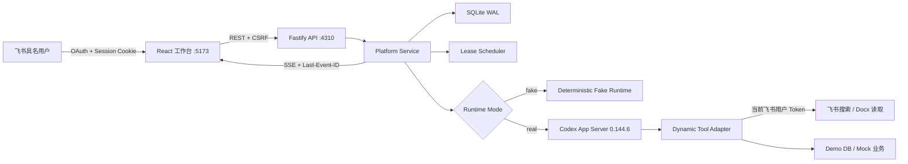
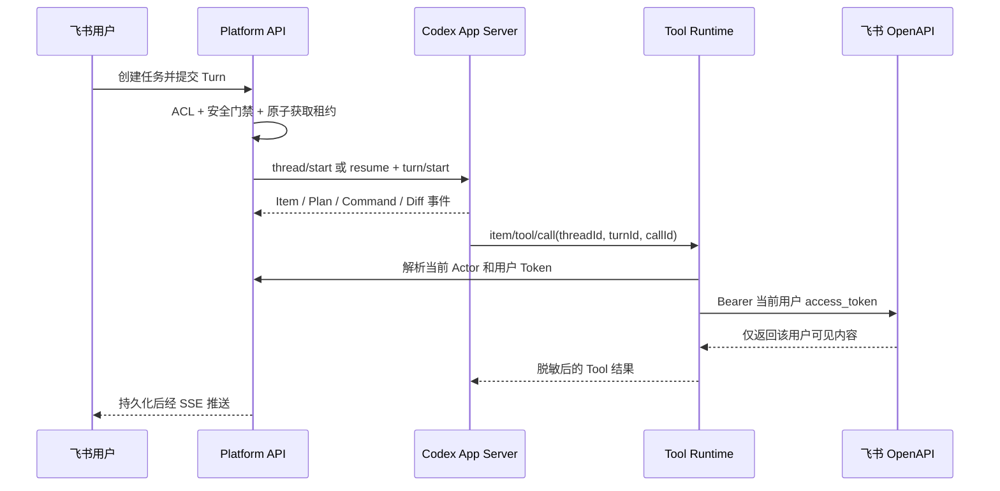

# 架构与数据流

## 目标与部署边界

当前交付是运行在单台 Mac、仅监听 loopback 的模块化单体。它验证从飞书具名用户到任务执行、账号租约、事件展示和企业 Tool 的完整纵切，但不包含容器集群、HA、KMS、Redis/NATS 或 PostgreSQL。

## 模块职责

| 模块 | 当前职责 |
| --- | --- |
| `apps/web` | 飞书登录入口、项目/任务、执行时间线、排队、审批、账号池和审计界面 |
| `apps/api/src/auth` | 飞书 OAuth、租户校验、用户/Session、Token 刷新 |
| `apps/api/src/domain` | 项目/任务、事件、审批、账号状态、租约和 FIFO 排队 |
| `apps/api/src/infra/codex` | JSONL RPC、App Server 进程、协议类型、Thread/Turn 和事件规范化 |
| `apps/api/src/tools` | Actor 绑定、飞书只读 Tool、安全 Demo SQL、Mock 业务 Tool |
| `apps/api/src/security` | AES-GCM Token 加密与 Codex 凭证隔离探针 |
| `packages/contracts` | 浏览器与后端共享的 `TaskEvent` 判别联合类型，以及严格 `TaskSummary` / `TaskDetail` Zod DTO |

## 身份和权限分离

系统中存在两类身份，不能互相替代：

1. 飞书用户身份决定谁能登录、能看到哪些项目/任务，以及飞书知识内容是否可读。
2. Codex 账号身份仅用于模型执行。浏览器不会拿到账号邮箱、Cookie、Token 或 `CODEX_HOME`。

真实 Dynamic Tool 请求会带 `threadId + turnId + callId` 回到后端。后端先通过 `ActorRegistry` 将 Thread/Turn 解析为任务所有者，再读取该用户加密保存的飞书 Token。Turn 已结束或绑定不匹配时，Tool 调用会失败关闭，而不是回退到共享 Codex 身份。

## 调度模型

账号预选不占槽，用户提交 Turn 时才在 SQLite `BEGIN IMMEDIATE` 事务中获取资源：

- 每个账号预建 4 个用户槽；第 5 个不同用户进入单调递增的 FIFO 队列。
- 同一用户在同一账号上复用一个用户槽，并拥有 2 个 Turn 槽；第 3 个并行 Turn 排队。
- 同一任务任一时刻最多有一个 active Turn；并发重复提交在 SQLite `BEGIN IMMEDIATE` 中原子拒绝并返回 HTTP 409。
- Turn 结束立即释放 Turn 槽；用户没有运行 Turn 后，用户槽保留到 30 分钟空闲超时。
- 如果保留用户槽的账号在下一个 Turn 边界已排空、隔离、失效或额度不可用，且该用户没有仍在运行的 Turn，调度器会原子释放旧槽并迁移到健康账号。
- 队列获得容量后自动从队首提升，并使用已持久化的 Prompt 启动。
- ETA 取最近 20 个已完成 Turn 的滚动中位数；样本不足时使用 10 分钟默认值并标记为估算。

多个账号的固定排序为：

1. 有已知周额度的账号优先，周额度剩余比例降序。
2. 活跃用户数升序。
3. 健康度降序。
4. 最久未分配优先。
5. 最后用账号 ID 保证稳定排序。

账号必须满足：`AVAILABLE`、已认证、健康度大于 0、额度大于 0，且额度快照不超过 5 分钟。没有精确 7 天窗口时会记录 `WEEKLY_QUOTA_UNKNOWN`；当前默认账号不允许以未知额度执行。

## Runtime 模式

### fake

`fake` 是默认模式。它使用同一套登录、项目、任务、槽位、队列、事件存储和 UI，但 Runtime 会立即产生确定性的 Plan、命令、Tool、Diff、Agent 消息和完成事件。它不启动 Codex App Server，也不调用真实 Feishu Tool。

因此，fake 可验证 4 人调度和产品展示，不能验证真实模型认证、沙箱隔离、额度接口或飞书 Tool 的端到端调用。

### real

`real` 为每个账号维护一个长期 App Server 进程和独立 `CODEX_HOME`，并固定使用：

- `@openai/codex@0.144.6`
- `app-server --stdio --strict-config`
- `cli_auth_credentials_store="file"`
- `approvalPolicy: on-request`
- `sandbox: workspace-write`

真实执行会先在隔离后的环境变量白名单中验证 CLI 版本，再执行 `initialize -> initialized`。任务使用 `thread/start` 或 `thread/resume`，Turn 使用 `turn/start`、`turn/steer`、`turn/interrupt`。同一账号的并发首次启动会复用一个 in-flight Promise，防止创建多个 App Server；停止时采用有界信号升级，服务端错误流只做内部排空。协议生成文件锁定在仓库中，可用 `pnpm codex:verify-protocol` 检查漂移。

## 数据与事件

SQLite 保存：

- 用户、飞书加密凭证、OAuth state、Session。
- Codex 账号安全摘要、用户槽、Turn 槽、租约、额度和队列。
- 项目、任务、Turn、审批、Tool 调用摘要和审计事件。
- 每任务单调递增 `sequence` 的 `task_events`。

浏览器首次打开任务时读取历史事件，随后用 SSE 订阅增量。断线重连会提交 `Last-Event-ID`，后端从 SQLite 重放更大的 sequence；SSE 随 Session 到期关闭，并在心跳时复核撤销状态。原始 Token、`CODEX_HOME`、租约 ID、排队票据、原始审批 RPC ID 和审批 payload 不属于浏览器响应。

任务详情通过共享 DTO 精确投影，只包含标题、状态、最新 Prompt、账号别名和实时排队信息；`ownerId`、租约 ID、Thread/Turn 内部标识及排队票据不会作为任务详情返回。事件中的 Thread、Turn 和 Item ID 仅作为用户自己任务的工作流关联标识保留，仍受 owner 鉴权；调度器 Turn、租约和 transport identity 不对浏览器公开。

审批请求先生成平台 UUID，再将账号、App Server 连接代次、Thread、Turn 和原始 RPC ID 作为内部 transport identity 保存。管理员决定后，状态按 `PENDING -> DELIVERY_PENDING -> DELIVERED` 推进；只有 App Server 的响应写入被确认后才算交付。连接已脱离或 Turn 已结束时进入 `RECOVERY_REQUIRED`，普通写失败则释放为可重试状态。若响应 delivery 本身失效，平台会清除该账号的 Actor/Thread 上下文、隔离账号并停止 App Server，然后才释放 Turn 槽。

终态任务更新使用 `task_id + current_turn_id` 条件写入。来自旧 Turn 的延迟事件可以继续进入不可变事件时间线，但不会覆盖新 Turn 的运行状态；Web 的即时投影把最新 `QUEUED` / `LEASE_ACQUIRED` 视为分配边界。`QUEUED` 不携带内部调度器 Turn ID，并会阻断所有旧 Turn 投影，直到带 Runtime Turn ID 的 `LEASE_ACQUIRED` 到达；仅在旧数据没有分配事件时才回退到最新 `TURN_STARTED`。启动 reconciliation 同时扫描运行/恢复中槽、残留等待队列和无租约的 `ALLOCATING` 记录，覆盖进程退出发生在“创建 Turn”“取得租约”和“写回队列状态”之间的窗口。

`startTask` 返回 Thread/Turn ID 前到达的 App Server 通知和审批请求，会先在 adapter 内按 Thread 暂存；Turn 身份和 Actor 绑定完成后才按原顺序处理。Platform Service 还会在运行映射和租约事件落库前暂存 adapter 事件，避免早到终态被后续 `RUNNING` 写入覆盖。若启动期间先收到终态，Actor 不会在启动 Promise 返回后被重新绑定；审批只在请求 Turn 仍是当前活跃 Turn 时进入可操作状态，adapter 还会再次校验连接代次和 Turn。

## Tool 范围

| Tool | 数据源 | 当前限制 |
| --- | --- | --- |
| `feishu_wiki_search` | 真实飞书搜索 | 查询最多 30 个 Unicode 字符，结果使用当前用户 Token |
| `feishu_doc_read` | 真实 Wiki/Docx | 只读文本块，最多 10,000 Blocks，返回 URL、revision 和 Block 引用 |
| `demo_db_query` | 本地 Demo SQLite | 仅单条 `SELECT`，仅 `demo_orders` / `demo_customers`，最多 100 行、256 KiB |
| `demo_business_get` | 确定性 Mock | 仅 `order` / `customer`，不是实际业务系统 |

所有企业外部写操作在本 MVP 中均未接入。
