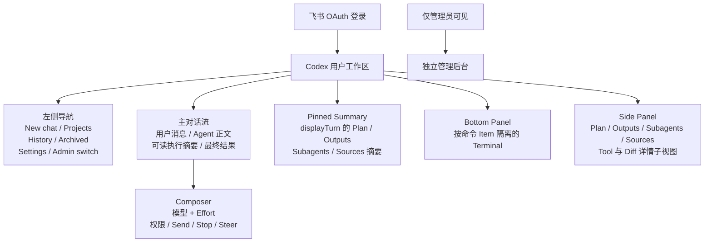
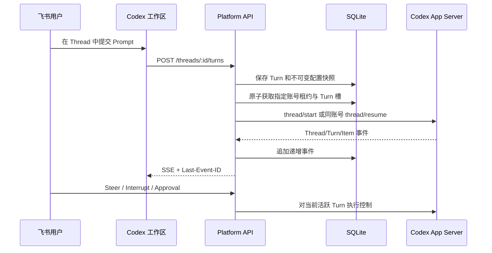
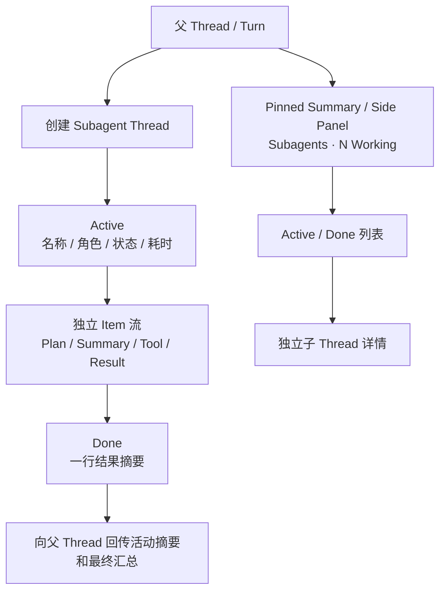
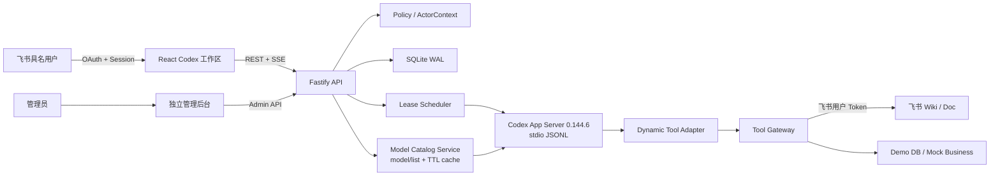
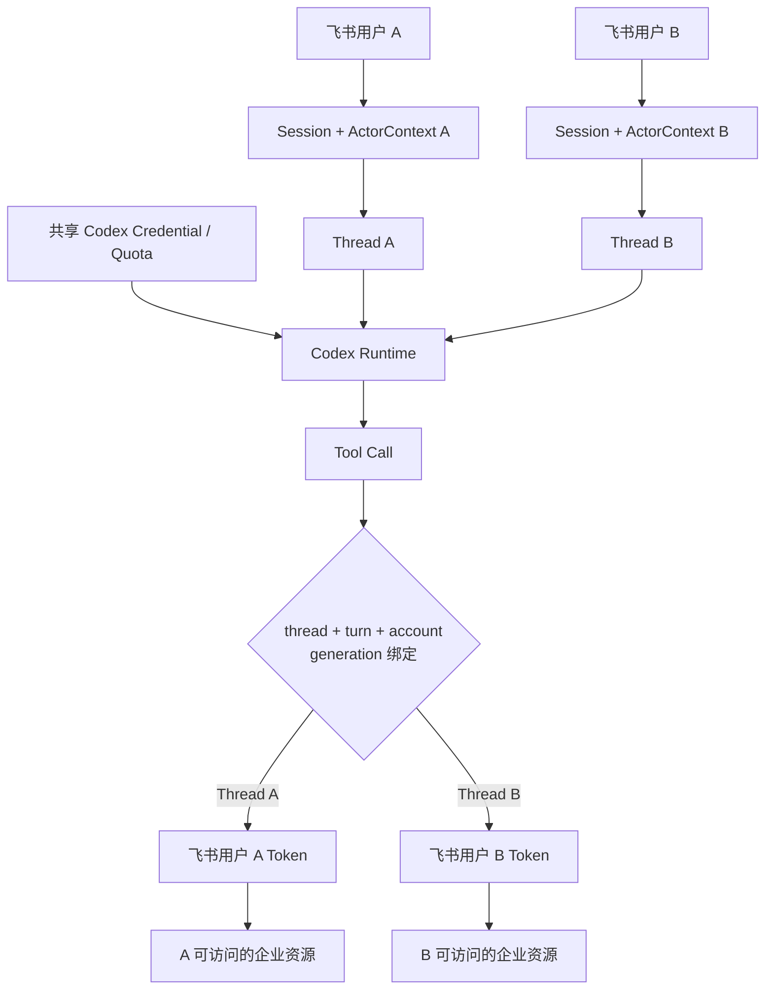
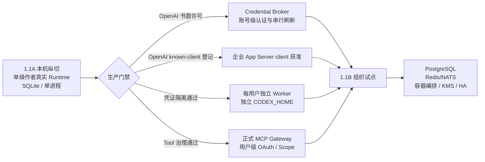

# CodexPlatform 1.1：Codex 式企业 AI 工作台产品与技术方案

> 文档状态：1.1 体验收敛 P0 实施基线
> 产品边界：1.1 只开放 Codex 模式；ChatGPT Chat / Work 保留为未来产品蓝图，不展示不可用入口
> 部署边界：1.1A 为本机单操作者真实纵切；1.1B 才提供生产级多用户 Worker 与共享账号治理

## 1. 方案结论

CodexPlatform 的目标不是复制一个聊天页面，而是为组织提供统一的 AI 工作入口：员工使用飞书具名身份登录，在 Codex 式连续工作区内完成编码、分析、知识检索和企业 Tool 调用；平台统一管理模型运行、权限、审批、额度、审计和企业系统接入。

1.1 采用以下产品边界：

- 用户端与管理后台彻底分离。员工只看到自己的 Project、Thread、Settings、Tool 和产物；管理员在独立后台管理账号、策略、连接器和审计。
- 用户端采用 Codex 的信息架构和交互语法：`Project → Thread → Turn → Item`，以连续对话承载长期任务，不再把每次执行表现为孤立的静态任务时间线。
- 用户工作区采用“主对话流 + Pinned Summary + Bottom Panel + Side Panel”。三个 Panel 是独立可组合的 Workspace Surface，不是固定右栏的三种尺寸。
- 模型选择由 App Server `model/list` 驱动；模型、Reasoning Effort、权限模式和运行控制统一位于 Composer，不维护静态模型清单。
- 1.1 只开放真实可用的 Codex 模式。ChatGPT Chat / Work 等到独立 Runtime 接入后再通过能力开关开放。
- 共享 Codex 账号只共享模型认证和额度，不共享飞书身份、Settings、Thread、文件、Connection、Memory 或 Tool 权限。
- 1.1A 继续复用现有 Fastify、React、SQLite、SSE、飞书 OAuth、Codex App Server、Tool Runtime、调度与审计基座，按纵切方式重构。
- 1.1A 的真实 Codex 仅允许首位管理员单操作者使用；凭证隔离探针、OpenAI 书面许可和生产 Worker 架构通过前，不开放真实多人共享。

## 2. 产品目标与非目标

### 2.1 目标

1. 让组织成员通过飞书身份进入统一 AI 工作区。
2. 让执行过程像 Codex 一样可理解、可干预、可审批、可追踪。
3. 让企业 Tool 始终以当前飞书用户身份访问知识库和业务资源。
4. 让每位用户在共享模型账号下仍拥有隔离的个人设置、会话与企业连接。
5. 为账号额度、并发、Tool、审批、异常和审计提供独立管理面。

### 2.2 1.1 非目标

- 不接入 ChatGPT Chat Runtime 或 Work Runtime。
- 不开放原生 Browser、Computer Use、Voice、Pets、个人 Billing。
- 不把未接入的附件、插件安装、Browser Worker 或 Office 原生对象能力伪装成可用功能。
- 不承诺 App Server 崩溃后从中断命令的机器指令位置继续。
- 不承诺已发生外部副作用的写操作可以自动重试。
- 不承诺本机 1.1A 已满足生产多用户隔离、HA、KMS 或跨天无人值守运行。

## 3. 用户端产品设计

### 3.1 登录

- 使用飞书 Web OAuth。
- 登录态由 HttpOnly、SameSite Cookie 保存；所有写接口校验 CSRF。
- 覆盖拒绝授权、OAuth state 失效、租户不匹配、Session 过期和重新授权。
- 登录成功后直接进入 Codex 工作区，不出现未开放模式的选择空壳。

### 3.2 Codex Workspace Shell



左侧导航：

- New chat。
- Project 列表。
- 最近 Thread、归档 Thread 和恢复入口；置顶属于后续能力。
- 用户头像、Settings。
- 仅管理员显示“进入管理后台”。

主对话流：

- 用户消息和 Codex 回复按 Turn 连续排列。
- 用户消息、Agent 正文和推理摘要使用安全 Markdown 渲染；禁用原始 HTML、危险 URI 和远程 Markdown 图片。推理摘要、命令、Tool、文件修改、审批和 Subagent 活动使用紧凑的可展开活动行。
- 每个 Item 由 `item/started` 建立、Delta 持续更新、`item/completed` 确认终态；同一 Item 的 Delta 不产生多张卡片。
- 主对话只保留用户可理解的工作叙事，不灌入完整 Terminal 输出、大段 Tool JSON、完整 Diff 或全部子 Agent 日志。
- `Transcript` 仅作为工程内部“主对话流投影”的名称，不是 App Server 领域实体；官方领域实体仍是 Thread、Turn、Item。

Composer：

- `+` 打开 `Add files and more`。1.1A 只展示真实交付的 `Files and folders`、`Goal` 和
  `Plan mode`；Record a skill、Plugins、Apps、Skills 和历史会话引用在接入前隐藏，不保留灰色空壳。
  菜单可用性由服务端 Capability Registry 决定，前端不能自行放开。
- 模型和 Effort 使用同一个联动选择器，选项来自当前账号的 `model/list`。
- 权限 Popover、发送、停止和运行状态位于同一操作区。
- Turn 运行中提交文本即 Steer；配置变更只对下一 Turn 生效。
- 发送与停止原位切换，不提供向 Runtime 发送固定“继续执行当前任务”文本的伪 Resume。

### 3.2.1 权限 Popover

权限选项由 Sandbox、Approval policy 和 Reviewer 三个正交维度展开：

| 用户选项 | Runtime 参数 | 企业边界 |
| --- | --- | --- |
| Ask for approval | `workspaceWrite + on-request + user` | 外部文件、网络或越权动作由用户审批 |
| Approve for me | `workspaceWrite + on-request + auto_review` | 只改变审批责任人，不扩大沙箱或网络范围 |
| Full access | `dangerFullAccess + never` | 1.1A 只允许本机 operator + 显式策略；1.1B 仅允许隔离 Worker 内完全访问 |
| Custom | `permissions=<profileId>` | 使用管理员发布的 Permission Profile，不能与 `sandboxPolicy` 同时提交 |

权限选择为 Thread sticky，运行中的 Turn 锁定；Steer 沿用当前 Turn 的不可变配置快照。组织策略
始终优先于个人偏好和 Thread 选择，前端与 API 必须同时执行门禁。

### 3.2.2 Add files and more

- Files and folders：点击后显示 `Choose files / Choose folder` 二级菜单，支持多文件、目录和拖放。
  浏览器只负责选择和上传；服务端扫描后将内容放入当前用户、当前 Thread 的隔离 staging workspace。
  图片映射为 `localImage`，其他文件或目录映射为受控路径引用与 `additionalContext`，绝不传浏览器
  本地路径。附件以紧凑 Chip 展示；未达到 READY 时禁止提交。
- Goal：使用稳定的 `thread/goal/set|get|clear`，属于 Thread 持久状态，跨 Turn 保留；支持编辑、
  暂停、恢复、完成和清除。原生 Token 预算默认为 200k，平台 Watchdog 默认 60 分钟，先到者暂停。
- Plan mode：使用锁定版本的实验性 `collaborationMode=plan`。选择为 Thread sticky，对当前及后续
  新 Turn 生效，直到用户关闭；活动 Turn 期间禁止切换，Steer 继承当前 Turn 快照。
- 在 `/threads/new` 首次选择文件或设置 Goal 时创建隐藏 Draft；Draft 不出现在左侧历史中，首次发送
  原子转为正式 Thread，废弃 Draft 与暂存文件自动过期清理。
- Record a skill、Plugins、Apps、Skills 和 Files and chats 属于后续能力，本轮不展示。它们只有在
  Runtime、组织策略、用户授权和真实纵切同时通过后才可重新进入 Capability Registry。

### 3.3 三个独立 Workspace Surface

三个 Surface 由三个独立按钮控制，可以同时开启：

| Surface | 布局 | 作用 | 1.1 内容 |
| --- | --- | --- | --- |
| Pinned Summary | 右上角悬浮摘要卡，不改变主对话宽度 | 快速查看 `displayTurn` 状态并导航，避免把历史 Turn 误当成当前进展 | `displayTurn` 的 Plan、Outputs、Subagents、Sources 数量与状态 |
| Bottom Panel | 底部 Dock | 承载完整命令输出，并保持命令 Item 边界 | Terminal |
| Side Panel | 右侧 Dock，单一活动视图 | 承载 Thread 级资源与详细检查 | Plan、Outputs、Subagents、Sources；Tool、Diff 为带返回入口的详情子视图 |

`displayTurn = activeTurn ?? latestTurn`：运行中优先当前 active Turn，终态后保留最近一轮摘要。1.1A
内部保存 Side 宽度与 Bottom 高度，供响应式布局使用，但尚未提供用户拖拽 Resize Handle，不把“可调
尺寸”列为本版能力。

```ts
interface WorkspaceLayoutState {
  pinnedSummaryOpen: boolean;
  bottomPanel: {
    open: boolean;
    tab: "terminal";
    detailId: string | null; // threadId + turnId + provider itemId
    height: number;
  };
  sidePanel: {
    open: boolean;
    tab:
      | { kind: "plan" | "outputs" | "subagents" | "sources" }
      | { kind: "subagent"; id: string }
      | { kind: "tool" | "changes"; detailId: string | null };
    width: number;
  };
}
```

路由规则：

| 内容 | 主对话流 | Pinned Summary | Side Panel | Bottom Panel |
| --- | --- | --- | --- | --- |
| Agent 回复 | 完整正文 | — | — | — |
| 推理摘要 | 紧凑可展开 | — | — | — |
| 命令 | 状态与摘要 | — | — | 按命令 Item 隔离的完整 Terminal I/O |
| Tool Call | 名称、状态、结果摘要 | — | 参数、结果、审批与资源 | — |
| 文件修改 | 文件数量与摘要 | Outputs | Diff、文件预览 | — |
| Plan | 当前步骤 | 完整计划摘要 | 计划详情 | — |
| Subagent | 活动摘要与最终汇总 | Active / Done 数量 | 独立子 Thread | — |
| Output / Source | 链接或摘要 | `displayTurn` 数量 | 预览和操作 | — |

Browser 属于后续 Browser Worker / Connector 能力，未接入前不出现在 1.1 用户界面。

### 3.4 模型与 Reasoning Effort

- Web 在渲染模型选择器前通过平台 API 获取 App Server `model/list`，平台不得维护静态 Codex 模型常量。
- 模型目录包含协议 `id`、实际 `model`、`displayName`、`hidden`、`isDefault`、默认 Effort、支持的 Effort、输入模态和 Personality 支持。
- 只展示 `hidden=false` 且符合组织策略的模型；支持的 Effort 保持 Runtime 返回顺序，并兼容未来未知字符串。
- 目录契约拒绝重复 Effort，且模型默认 Effort 必须属于其支持列表；`scope=SINGLE_ACCOUNT` 时 `accountCount` 必须为 1。
- 新建 Thread 默认选择目录中的 `isDefault` 模型；用户偏好只在该账号仍支持时生效。
- 切换模型后，当前 Effort 不受支持时自动回落到该模型的默认 Effort，并明确展示变化。
- `thread/start` 和 `turn/start` 发送所选模型与 Effort；Turn 保存不可变请求快照和 Runtime 实际模型。
- 收到模型重路由通知时，在主对话流中展示，并更新实际模型；不能把请求模型伪装为实际模型。
- 模型目录读取失败时显示错误；允许使用带 `observedAt` 的短期缓存，但不能静默回退到硬编码模型。
- 未绑定账号的新 Thread 只展示当前所有合格账号共同支持的模型与 Effort 交集；已绑定账号的 Thread 展示该账号目录。目录响应以 `scope`、`accountCount` 和 `observedAt` 说明计算范围与新鲜度，不向浏览器暴露账号 ID、别名或凭证目录。
- 多账号阶段，调度器只能把 Turn 分配给支持所选模型的账号；账号分配后必须再次校验，避免目录读取与租约获取之间的竞争条件。

### 3.5 连续 Thread 与恢复



关键规则：

- 旧 Thread 后续 Turn 必须继续使用原 Codex 账号和原 `CODEX_HOME`，不能隐式跨账号恢复。
- `thread/resume` 返回仍有 `inProgress` Turn 时绝不能再次调用 `turn/start`。1.1A 在没有独立恢复入口和完整并发映射前采用 Fail Closed：停止该账号 App Server、隔离账号、把任务标记为 `NEEDS_RECOVERY`，并明确拒绝本次新 Prompt；1.1B 才提供可证明身份一致的活动 Turn 重连。
- 浏览器断线只影响展示连接，不自动释放正在运行的 Turn。
- SSE 使用 `Last-Event-ID` 重放；消息增量按 `threadId + turnId + itemId` 合并。
- 缺少稳定 `itemId` 的增量事件 Fail Closed，不跨 Item 猜测合并。
- 已发生外部副作用的 Tool Call 不自动重放。

### 3.6 推理展示

- 产品只展示 Codex 返回的 `reasoning.summary`，统一命名为“执行思路”或“推理摘要”。
- 服务端在持久化、REST 返回和 SSE 重放三个边界识别 reasoning envelope；`reasoningTextDelta`、原始 `content` 和 `encrypted_content` 在进入数据库或浏览器前整体剥离，只保留允许公开的 summary 元数据。
- 推理摘要用于帮助用户理解进展，不作为审计证据。
- 审计依据是 Plan、命令、Tool Call、Diff、审批、外部系统回执和最终结果。
- 未来其他供应商返回的推理文本必须标注供应商和类型，不能宣称为必然真实、完整的原始思维链。

### 3.7 Subagent



交互遵循 Codex 当前形式：

- Pinned Summary 显示 `Subagents · N Working` 摘要；点击后在 Side Panel 打开列表。
- 展开后按 Active / Done 分组。
- 每行展示头像、名称、状态、耗时和一行结果摘要。
- 点击进入独立子 Agent Thread；顶部返回 Subagents 列表。子 Thread 内更深层 Agent 活动在 1.1A
  作为只读状态行展示，不提供无效的伪导航。
- 主对话只接收子 Agent 活动摘要和最终汇总，不灌入全部中间日志。
- 1.1 详情以只读检查为主；停止和 Steer 通过父 Turn 控制。父 Turn 终态后，用户必须在 Composer
  明确输入下一轮要求，不伪造直接子 Agent 控制或固定文本 Resume。

平台治理补充：

- 子 Agent 继承父 Turn 的飞书用户 `ActorContext`、Sandbox、权限模式和 Tool 范围。
- Token、耗时和额度按完整 Thread 树归集。
- 审批标注来源子 Agent，并关联父 Thread、用户和账号租约。
- 单 Turn、单用户、单账号的子 Agent 并发和预算上限属于 1.1B 组织治理目标；1.1A 尚未交付硬预算执行器。

## 4. 用户 Settings

共享账号不等于共享配置。用户偏好归属于飞书用户，保存于平台数据库，并在创建 Thread/Turn 时合并为不可变快照。

1.1 Settings 包含：

| 分组 | 1.1 能力 |
| --- | --- |
| General | 语言、主题、默认项目、通知均可持久化；仅默认项目已接入 New chat |
| Profile | 飞书姓名、头像、组织、角色，只读身份信息 |
| Execution | Runtime 模型目录、模型级 Effort、权限模式和固定 `ASK` 审批偏好进入有效配置 |
| Personalization | Personality、个人 Instructions 进入有效配置 |
| Connections | 当前用户企业连接状态的只读视图；1.1A 无重新授权入口 |
| Plugins | 管理员批准目录为空；只读且不允许安装或启用 |
| Usage | 个人 Thread、Turn、Token 与 Tool 使用只读概览 |
| Archived chats | 已支持归档、查看和恢复；置顶属于后续能力 |

1.1A 当前配置合并顺序：

1. 组织强制策略。
2. 组织默认值。
3. 用户偏好。
4. Thread 覆盖。
5. Turn 覆盖。

后级覆盖不得突破组织强制策略。生效配置以 `EffectiveThreadConfigSnapshot` 写入每个 Turn，保证历史可解释、可审计，不受后续 Settings 修改影响。Project 级执行设置是后续能力，接入后位于用户偏好与 Thread 覆盖之间。

## 5. 管理后台

管理后台使用独立路由、壳和导航，只对管理员开放。1.1A 当前实现为：

- Accounts：账号添加、交互登录、额度/占用/健康度查看、排空、隔离和恢复。
- Policies、Connectors、Usage、Audit、Runtime health：只读组织投影。
- 用户/角色目录、策略编辑、连接器写入、Subagent 硬并发/预算、Worker 治理：明确标记为后续能力。

普通用户不能通过页面入口、直接 URL 或 API 获取管理数据。

## 6. 技术架构

### 6.1 1.1A 当前纵切



技术栈：

- Node.js 22、pnpm、TypeScript。
- Fastify API。
- React、Vite、TanStack Query。
- SQLite WAL 与原子事务。
- REST 命令、SSE 事件流和 `Last-Event-ID` 重放。
- 固定 `@openai/codex@0.144.6`，使用 App Server stdio JSONL。
- Vitest、Playwright、Biome。

### 6.2 数据模型

核心信息模型为：

```text
Tenant
 ├─ User
 │   ├─ UserSettings
 │   ├─ UserConnection
 │   └─ Project
 │       └─ Thread
 │           ├─ Turn
 │           │   ├─ EffectiveThreadConfigSnapshot
 │           │   └─ ThreadItem
 │           └─ SubagentThread
 └─ Admin domain
     ├─ CodexAccount / QuotaSnapshot
     ├─ AccountLease / QueueEntry
     ├─ OrgPolicy / ConnectorPolicy
     └─ AuditEvent
```

关键类型：

- `ProductMode = CODEX | CHAT | WORK`；1.1 的 enabled modes 只有 `CODEX`。
- `Thread`：Project、用户、Runtime、账号粘性、父子关系和配置。
- `Turn`：Prompt、模型、Effort、权限模式、状态和 Token。
- `ThreadItem`：Message、Plan、ReasoningSummary、Command、Tool、Diff、Approval、SubagentActivity、Result。
- `ModelOption`：Runtime 模型 ID、显示名、默认值、支持的 Effort、输入模态、Personality 与可见性。
- `ModelCatalog`：账号或 Runtime 作用域的模型列表、读取时间、缓存状态和目录版本。
- `TranscriptEntry`：由一个或多个 Item 事件投影出的用户消息、Agent 正文或紧凑活动行。
- `WorkspaceLayoutState`：三个独立 Surface 的开关、尺寸、活动 Tab 与 Tab 列表。
- `ComposerCapability`：能力类型、分区、来源、可用状态、禁用原因与组织策略。
- `ContextAttachment`：FILE/FOLDER/IMAGE/THREAD/FEISHU_DOC/APP/SKILL 引用及
  UPLOADING/SCANNING/READY/BLOCKED 等状态。
- `DraftThread`：隐藏草稿及其 `DRAFT → ACTIVE | EXPIRED` 生命周期。
- `ThreadGoal`：目标、状态、Token 预算、平台时间预算、用量与恢复状态。
- `ComposerState`：Plan mode、Goal 和 Draft Attachment 的 Thread 级可见状态。
- `ExecutionPermission`：用户模式及其展开后的 Sandbox、Approval policy、Reviewer、Profile 和来源。
- `EffectiveTurnInputSnapshot`：提交时解析后的文本、附件、Goal/Plan、权限和供应商输入。
- `ActorContext`：Tenant、飞书用户、角色、Tool Scope 和审批策略。
- `ReasoningPresentation`：Provider、Kind、Summary、可展示状态、`auditEligible=false`。

### 6.3 主要 API

```text
GET  /api/bootstrap
GET  /api/models
GET  /api/composer/capabilities
GET  /api/auth/feishu/start|callback|session
GET  /api/projects
POST /api/projects
GET  /api/threads
POST /api/threads
POST /api/threads/drafts
GET  /api/threads/:id
DELETE /api/threads/:id/draft
POST /api/threads/:id/turns
POST /api/threads/:id/attachments
DELETE /api/threads/:id/attachments/:attachmentId
GET  /api/threads/:id/goal
PUT  /api/threads/:id/goal
PATCH /api/threads/:id/goal
DELETE /api/threads/:id/goal
PATCH /api/threads/:id/composer
POST /api/threads/:id/steer
POST /api/threads/:id/interrupt
GET  /api/threads/:id/events
GET  /api/threads/:id/subagents
GET  /api/subagents/:threadId
GET  /api/me/settings
PATCH /api/me/settings
GET  /api/me/usage|connections|plugins
GET  /api/admin/accounts|policies|connectors
GET  /api/admin/usage|audit|runtime-health
POST /api/admin/accounts
POST /api/admin/accounts/:id/login
POST /api/admin/accounts/:id/{drain|quarantine|restore}
```

1.1A 的 Policies、Connectors、Usage、Audit 和 Runtime health 均为只读投影；策略和连接器写接口属于后续治理能力。旧 `/tasks/:id` URL 重定向到对应 `/threads/:id`，迁移期间保留兼容读取。

## 7. 身份、账号与 Tool 隔离

下图描述 1.1B 通过许可和隔离门禁后的多人目标。1.1A 仅在 Fake Runtime 中模拟 A/B 两名用户的
调度与 ACL；1.1A Real 只允许指定 operator 使用真实 Codex Runtime。



安全规则：

- Codex 账号身份仅用于模型执行，不能决定企业资源权限。
- Tool 必须解析 `threadId → turnId → ActorContext`，缺失绑定时 Fail Closed。
- Tool 绑定同时校验 Codex 账号与 App Server 连接代次，防止崩溃重启后的旧请求串线。
- 浏览器不返回账号别名、邮箱、Cookie、Token、`CODEX_HOME`、租约 ID 或原始审批 RPC ID。
- 原始推理字段在事件持久化、REST DTO 和 SSE 重放边界统一剥离；前端过滤只是纵深防御，不是第一道安全边界。
- Tool 结果中的 `artifactId` 可以作为不可点击的 Output 元数据；只有 HTTPS 资源能成为 1.1A
  可点击链接。按用户和 Thread 鉴权的同源 Artifact 下载接口尚未实现，因此 `/api/artifacts/*`
  不提升为链接。绝对文件路径和 `file:`、`javascript:`、`data:` 等 URI 不进入资源列表。
- Transcript Markdown 禁用原始 HTML和远程图片，链接只允许受控协议，不能使用 `dangerouslySetInnerHTML`。
- 子 Thread 不能被其他用户复用；所有列表、详情、SSE 和审批接口执行 owner ACL。
- 外部写操作要求审批和幂等键；副作用已经发生时不自动重试。

## 8. 账号调度与额度

以下四槽、双 Turn 和 FIFO 规则在 1.1A 由 Fake Runtime 做确定性多人验收；1.1A Real 仍受“单
operator”门禁约束。只有 1.1B 通过 OpenAI 许可、独立 Worker / `CODEX_HOME` 和凭证隔离探针后，
这些规则才可用于真实多人 Codex 执行。

- 登录只预选账号，不占用并发槽。
- 首次提交 Turn 时在 SQLite 原子事务中获取租约。
- 单账号最多 4 名活跃飞书用户。
- 同一用户多个 Thread 共用一个账号用户槽，最多同时运行 2 个 Turn。
- 第 5 名用户或同用户第 3 个 Turn 进入单调递增 FIFO 队列。
- 账号排序：周额度剩余比例降序 → 活跃用户数升序 → 健康度降序 → 最久未分配。
- 额度超过 5 分钟未刷新、认证失效、额度耗尽、排空或隔离账号不接收新 Thread。
- 已创建的 Thread 必须保持账号粘性；原账号不可用时在该账号上等待或明确失败，不隐式迁移。
- Turn 完成立即释放 Turn 槽；用户无运行 Turn 30 分钟后释放账号用户槽。

## 9. App Server 与协议治理

- 固定使用 `@openai/codex@0.144.6`。
- 平台到 App Server 的传输固定为 stdio JSONL，不使用实验性的网络监听模式。
- App Server 到 OpenAI 使用平台内部 HTTPS-only Provider，复用现有 ChatGPT 登录认证，并声明
  `supports_websockets=false`；它用于消除当前环境 WebSocket 握手超时后的回退等待，不改变模型、
  额度和账号归属。
- Provider ID 使用 `codexplatform_openai_https`，但 Provider 名称必须保持官方精确值 `OpenAI`；
  Codex 当前通过名称判断 OpenAI 专属能力，改名会关闭远端上下文压缩，不适用于长 Turn（见
  [0.144.6 Provider 源码](https://github.com/openai/codex/blob/rust-v0.144.6/codex-rs/model-provider-info/src/lib.rs)）。
- 当前 Codex 尚未提供正式的 `--transport=https` 开关（见
  [openai/codex#27381](https://github.com/openai/codex/issues/27381)）；该适配必须随 Codex
  固定版本锁定，并在每次升级时重新验证模型目录、认证、额度和真实 Turn。官方提供等价开关后优先
  迁移到官方配置。
- 初始化固定为 `initialize → initialized`。
- 使用 `thread/start/resume`、`turn/start/steer/interrupt`。
- 在渲染模型选择器前调用稳定的 `model/list`；目录分页读取、缓存、组织策略求交集和模型级 Effort 校验由平台负责。
- 未知模型或 Effort 在提交前拒绝；协议新增的未知 Effort 可显示但不能被旧枚举丢弃。
- `turn/steer` 不携带模型、Effort、cwd 或沙箱覆盖；运行中配置调整只对下一 Turn 生效。
- 模型重路由、错误、警告、重试和上下文压缩事件进入可读事件投影，不能在 Normalizer 默认分支静默丢弃。
- 升级必须执行 TypeScript Schema 重新生成、Schema Diff、Golden Replay 和协议合约测试。
- 未知事件、未知敏感字段和身份绑定缺失均 Fail Closed。
- Dynamic Tools 仅为 1.1A 过渡适配层；1.1B 替换为正式 MCP Gateway。
- 原生 Plugin 安装接口和 App 列表中的实验能力不作为 1.1 生产依赖。
- `thread/goal/*` 可直接作为稳定 Goal 适配；`collaborationMode`、Plugin 市场和安装接口按各自协议
  稳定性分开处理，不能因为同属 App Server 就统一宣称稳定。
- Composer 上传和引用由平台 Artifact/Staging 层处理；App Server 的 `UserInput` 只接受 text、
  image、localImage、skill 和 mention，不存在通用二进制附件对象。

## 10. Memory、插件与个性化边界

- 共享账号阶段关闭原生 Codex Memory，避免同一个可写 `CODEX_HOME` 混合不同用户历史。
- 1.1A real Runtime 在新建或恢复 Thread 后、任何 `turn/start` 前强制执行
  `thread/memoryMode/set { mode: "disabled" }`；RPC 失败或响应畸形时隔离账号并拒绝本次
  Prompt。该控制不能替代 1.1B 的独立 Worker、独立 `CODEX_HOME` 与跨用户哨兵验证。
- 平台后续 Memory 按 `tenant + user + project` 隔离，并提供启用、贡献、查看、删除、导出和留存策略。
- 用户 Instructions 存平台数据库；Project 规则来自仓库 `AGENTS.md`；组织强制规则由 Policy 层注入。
- 1.1A 普通用户只能看到空的管理员批准插件目录，不能启用或安装 Hook、MCP Server 或本地代码；插件启用属于后续能力。
- 1.1A Connections 只读展示当前飞书用户的连接状态；用户级 OAuth Token、Scope、到期、解绑和重新授权治理属于后续目标，且不得依赖共享 Codex 账号状态。

## 11. 1.1A 到 1.1B 演进



1.1B 目标结构：

```text
共享 Codex Account Credential / Quota
                ↓
      Account Credential Broker
                ↓
飞书用户 A → Worker A → CODEX_HOME A
飞书用户 B → Worker B → CODEX_HOME B
飞书用户 C → Worker C → CODEX_HOME C
飞书用户 D → Worker D → CODEX_HOME D
```

账号级 Token 刷新串行执行；Thread、Settings、Connection、文件、插件状态和 Memory 全部按飞书用户隔离。

## 12. 验收标准

### 12.1 产品验收

- 飞书登录后直接进入 Codex 工作区，不出现不可用 Chat/Work 入口。
- 用户端与管理后台路由、导航和权限清晰分离。
- Composer 展示当前账号真实模型目录；模型与 Effort 联动，最终 `thread/start` / `turn/start` 参数和 Turn 快照一致。
- 权限 Popover 的 Ask for approval、Approve for me、Full access 与 Custom 映射到正确 Runtime
  参数；组织策略和 Worker 门禁无法通过直接 API 绕过。
- Add 菜单由 Capability Registry 驱动；1.1A 只显示 Files、Goal 和 Plan，其他未接入能力隐藏。
- 文件上传完成扫描和 owner ACL 后才能提交；图片使用 `localImage`，普通文件和目录只引用受控
  staging 路径，浏览器本地路径不会进入 Runtime、SSE 或日志。
- 隐藏 Draft 不出现在历史列表；首次提交原子转为正式 Thread；废弃 Draft 和暂存文件按 TTL 清理。
- Goal 跨 Turn 保留并支持编辑、暂停、恢复、完成和清除；200k Token 或 60 分钟预算先到即暂停。
- Plan mode 的图标、菜单状态、Thread 持久化与实际 `collaborationMode` 一致，活动 Turn 中不可切换。
- 主对话流以用户消息、Agent Markdown 和紧凑活动行呈现；同一 Item 的流式 Delta 不生成重复卡片。
- Pinned Summary、Bottom Panel、Side Panel 可以独立开关和组合存在；关闭 Side Panel 后主对话恢复完整宽度。
- 点击 Output、Source 或 Subagent 摘要时在 Side Panel 打开对应 Tab；Terminal 只在 Bottom Panel
  打开。Browser Worker 尚未接入，1.1 不展示 Browser 摘要或入口。
- 连续 Thread 支持多 Turn、停止、Steer 和断线重连；中断或终态后由用户在 Composer 明确提交
  下一 Turn，不发送固定“继续”文本。
- 推理摘要连续显示；raw reasoning 在持久化、REST、SSE 与浏览器四个边界均不存在。
- Subagents 面板具备 Active/Done、摘要列表和独立详情。
- Settings 按飞书用户独立保存，共享账号不会串用。
- 普通用户看不到账号凭证、账号别名、真实 Runtime / `CODEX_HOME` 路径、管理数据或其他用户
  Thread。

### 12.2 调度与恢复

- 5 个不同用户争抢 1 个账号时，最多 4 个获得用户槽，第 5 个排队。
- 同一用户 2 个并行 Turn 只占 1 个用户槽，第 3 个 Turn 排队。
- 释放槽位后 FIFO 队首自动获得资源。
- 旧 Thread 的新 Turn 只能使用原账号。
- 恢复检测到活动 Turn 时没有第二次 `turn/start`；1.1A 明确拒绝新 Prompt、隔离账号并进入 `NEEDS_RECOVERY`，不宣称已经续跑。
- 浏览器、API 或 App Server 重连不会重复执行已有副作用的 Tool。

### 12.3 安全与数据

- 子 Agent Tool Call 始终继承父 Turn 的飞书用户 `ActorContext`。
- 主 Thread 和全部子 Thread 的 Token、耗时、额度与审批正确归集。
- 普通用户不能通过列表、URL、SSE、审批或子 Agent 详情访问他人数据。
- 哨兵 Token 不出现在浏览器响应、SQLite、事件、日志或异常中。
- Codex 沙箱不能读取共享凭证目录中的哨兵文件；失败则禁止真实多人执行。
- 协议升级、未知事件和敏感字段均有 Fail Closed 测试。
- 模型目录分页、隐藏模型、默认模型、模型级 Effort、非法配置、缓存失效和模型重路由均有合约测试。

### 12.4 外部链路

- 真实 Codex Smoke 和真实 Feishu Smoke 必须单独显式运行并保留脱敏证据。
- 代码中存在测试不等于外部链路已经验证。
- OpenAI 书面许可必须明确覆盖后台凭证托管、多人并发与自动调度，否则切换为具名席位或允许面向终端用户的 API/服务账号模式。
- 组织试点前还必须按 App Server 初始化要求联系 OpenAI，将 `codexplatform` 加入 known clients；发送 `clientInfo` 不能替代批准。

## 13. 官方事实依据

- [OpenAI Reasoning](https://developers.openai.com/api/docs/guides/reasoning)：原始 reasoning token 不暴露，可按模型能力请求 summary。
- [Codex App Server](https://learn.chatgpt.com/docs/app-server)：Thread、Turn、Item、审批、事件、认证和额度协议。
- [Codex Subagents](https://learn.chatgpt.com/docs/agent-configuration/subagents)：父子 Agent、独立 Thread 和权限继承。
- [Codex Long-running work](https://learn.chatgpt.com/docs/long-running-work)：长 Turn、Steer、Interrupt 和 Resume 的产品边界。
- [Codex Integrated terminal](https://learn.chatgpt.com/docs/integrated-terminal)：每个 Chat 下绑定当前 Project 或 Worktree 的底部 Terminal。
- [Codex Worktrees](https://learn.chatgpt.com/docs/environments/git-worktrees)：独立 Chat 的隔离工作区与 Handoff。
- [OpenAI Services Agreement](https://openai.com/policies/services-agreement/)：账号凭证和生产使用的合同边界。

## 14. 当前状态声明

本方案同时描述 1.1 产品目标和生产演进。仓库中的“已实现”状态必须以当前 commit、自动测试、浏览器 UAT 和外部 Smoke 证据为准：

- 本机 fake Runtime 可用于调度、UI 和权限回归。
- 本轮 PR Head 已实现 Runtime 模型目录、模型/Effort 联动、连续 Transcript、三个独立
  Workspace Surface、安全 Markdown、复合 Item 详情边界和运行路径脱敏；是否“通过”仍以
  `pnpm verify`、真实浏览器 UAT 与外部 Smoke 的独立证据为准。
- Files/Folders、隐藏 Draft、Goal 和 Plan mode 当前处于本轮实施中；只有自动测试、浏览器 UAT、
  App Server 参数证据和数据复核均通过后，才从“实施中”更新为“已验证”。
- real Runtime 的单操作者纵切需要实际完成 Codex 登录并通过 Smoke 才能标记为已验证。
- 真实飞书 Tool 需要当前飞书用户 Token 和可读测试文档，必须独立验收。
- 生产多人执行、独立 Worker、Credential Broker、正式 MCP Gateway、PostgreSQL、消息总线、KMS 和 HA 属于 1.1B 规划，不属于 1.1A 已实现能力。
