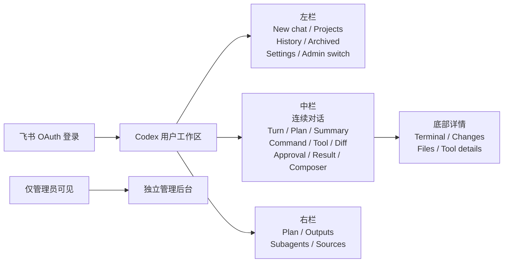
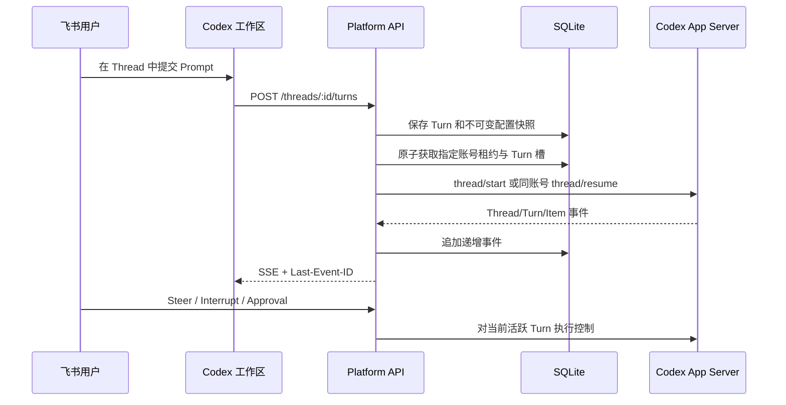
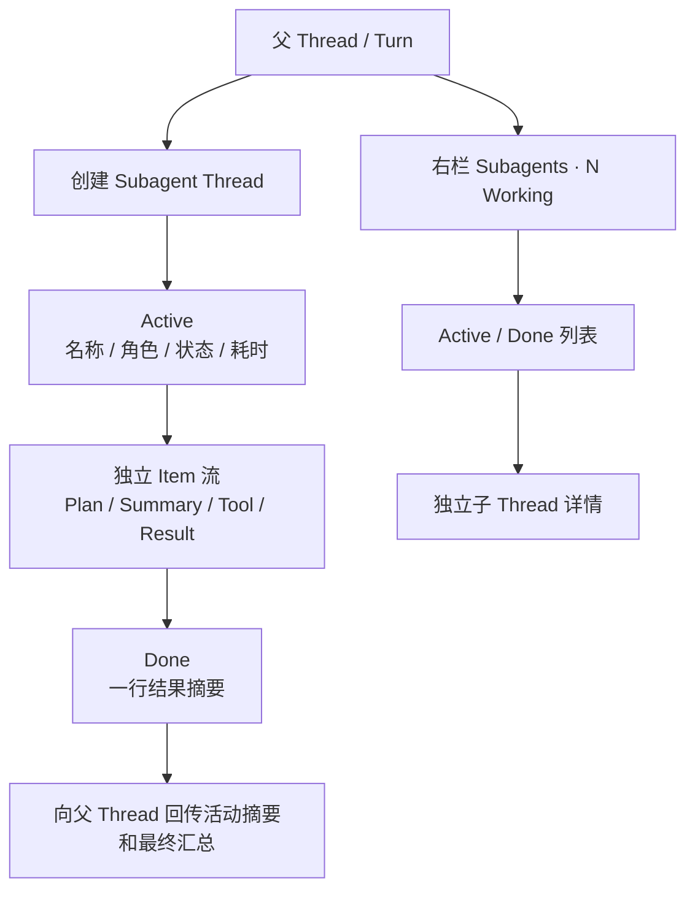
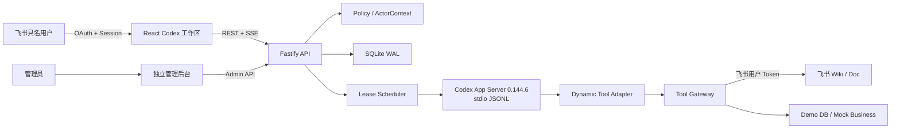
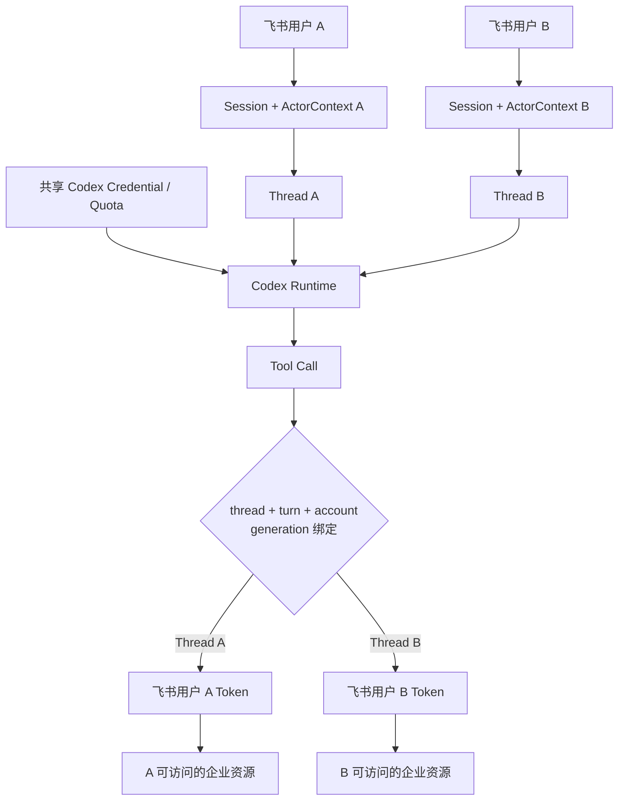
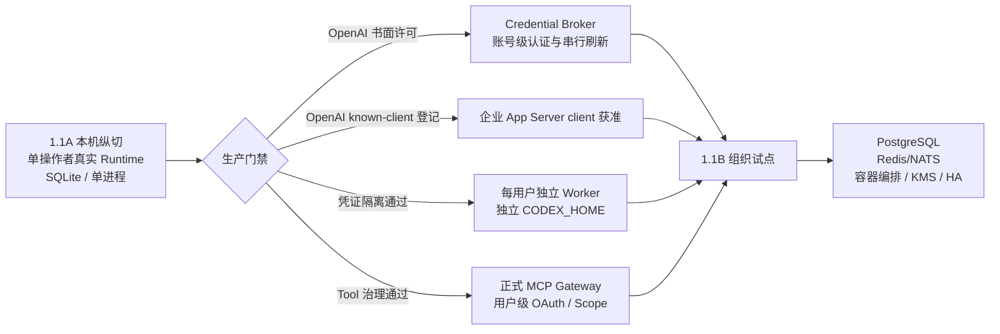

# CodexPlatform 1.1：Codex 式企业 AI 工作台产品与技术方案

> 文档状态：1.1 实施与验收基线  
> 产品边界：1.1 只开放 Codex 模式；ChatGPT Chat / Work 保留为未来产品蓝图，不展示不可用入口  
> 部署边界：1.1A 为本机单操作者真实纵切；1.1B 才提供生产级多用户 Worker 与共享账号治理

## 1. 方案结论

CodexPlatform 的目标不是复制一个聊天页面，而是为组织提供统一的 AI 工作入口：员工使用飞书具名身份登录，在 Codex 式连续工作区内完成编码、分析、知识检索和企业 Tool 调用；平台统一管理模型运行、权限、审批、额度、审计和企业系统接入。

1.1 采用以下产品边界：

- 用户端与管理后台彻底分离。员工只看到自己的 Project、Thread、Settings、Tool 和产物；管理员在独立后台管理账号、策略、连接器和审计。
- 用户端采用 Codex 的信息架构和交互语法：`Project → Thread → Turn → Item`，以连续对话承载长期任务，不再把每次执行表现为孤立的静态任务时间线。
- 1.1 只开放真实可用的 Codex 模式。ChatGPT Chat / Work 等到独立 Runtime 接入后再通过能力开关开放。
- 共享 Codex 账号只共享模型认证和额度，不共享飞书身份、Settings、Thread、文件、Connection、Memory 或 Tool 权限。
- 1.1A 继续复用现有 Fastify、React、SQLite、SSE、飞书 OAuth、Codex App Server、Tool Runtime、调度与审计基座，按纵切方式重构。
- 1.1A 的真实 Codex 仅允许首位管理员单操作者使用；凭证隔离探针、OpenAI 书面许可和生产 Worker 架构通过前，不开放真实多人共享。

## 2. 产品目标与非目标

### 2.1 目标

1. 让组织成员通过飞书身份进入统一 AI 工作区。
2. 让执行过程像 Codex 一样可理解、可干预、可审批、可追踪。
3. 让企业 Tool 始终以当前飞书用户身份访问知识库和业务资源。
4. 让每位用户在共享模型账号下仍拥有隔离的个人设置、会话与企业连接。
5. 为账号额度、并发、Tool、审批、异常和审计提供独立管理面。

### 2.2 1.1 非目标

- 不接入 ChatGPT Chat Runtime 或 Work Runtime。
- 不开放原生 Browser、Computer Use、Voice、Pets、个人 Billing。
- 不把未接入的附件、模型目录、插件安装或 Office 原生对象能力伪装成可用功能。
- 不承诺 App Server 崩溃后从中断命令的机器指令位置继续。
- 不承诺已发生外部副作用的写操作可以自动重试。
- 不承诺本机 1.1A 已满足生产多用户隔离、HA、KMS 或跨天无人值守运行。

## 3. 用户端产品设计

### 3.1 登录

- 使用飞书 Web OAuth。
- 登录态由 HttpOnly、SameSite Cookie 保存；所有写接口校验 CSRF。
- 覆盖拒绝授权、OAuth state 失效、租户不匹配、Session 过期和重新授权。
- 登录成功后直接进入 Codex 工作区，不出现未开放模式的选择空壳。

### 3.2 Codex 式三栏工作区



左栏：

- New chat。
- Project 列表。
- 最近 Thread；归档仅有导航与空状态，置顶和归档/恢复数据流属于后续能力。
- 用户头像、Settings。
- 仅管理员显示“进入管理后台”。

中栏：

- 用户消息和 Codex 回复按 Turn 连续排列。
- Plan、执行思路、命令、Tool Call、Diff、审批和最终结果以 Item 形式嵌入对话。
- 长输出折叠为摘要，可在底部详情查看完整可展示内容。
- Composer 支持提交、停止、继续和 Steer。
- 1.1A 模型仅显示“Runtime 默认模型；模型目录尚未接入”，不提供虚假模型选择。

右栏：

- Plan：当前计划和完成进度。
- Outputs：本次执行产生的文件、链接、Diff 和可下载产物。
- Subagents：Active / Done 分组、状态、耗时、摘要和详情入口。
- Sources：飞书文档、文件和 Tool 返回的引用。

底部详情：

- Terminal：命令和脱敏后的 stdout/stderr。
- Changes：文件 Diff。
- Files：当前 Thread 可见的产物。
- Tool details：输入摘要、权限身份、结果摘要、耗时和审批。

### 3.3 连续 Thread 与恢复



关键规则：

- 旧 Thread 后续 Turn 必须继续使用原 Codex 账号和原 `CODEX_HOME`，不能隐式跨账号恢复。
- `thread/resume` 返回仍有 `inProgress` Turn 时绝不能再次调用 `turn/start`。1.1A 在没有独立恢复入口和完整并发映射前采用 Fail Closed：停止该账号 App Server、隔离账号、把任务标记为 `NEEDS_RECOVERY`，并明确拒绝本次新 Prompt；1.1B 才提供可证明身份一致的活动 Turn 重连。
- 浏览器断线只影响展示连接，不自动释放正在运行的 Turn。
- SSE 使用 `Last-Event-ID` 重放；消息增量按 `threadId + turnId + itemId` 合并。
- 缺少稳定 `itemId` 的增量事件 Fail Closed，不跨 Item 猜测合并。
- 已发生外部副作用的 Tool Call 不自动重放。

### 3.4 推理展示

- 产品只展示 Codex 返回的 `reasoning.summary`，统一命名为“执行思路”或“推理摘要”。
- `reasoningTextDelta`、原始 `content` 和 `encrypted_content` 不进入浏览器、日志、搜索或审计表。
- 推理摘要用于帮助用户理解进展，不作为审计证据。
- 审计依据是 Plan、命令、Tool Call、Diff、审批、外部系统回执和最终结果。
- 未来其他供应商返回的推理文本必须标注供应商和类型，不能宣称为必然真实、完整的原始思维链。

### 3.5 Subagent



交互遵循 Codex 当前形式：

- 右栏显示 `Subagents · N Working`。
- 展开后按 Active / Done 分组。
- 每行展示头像、名称、状态、耗时和一行结果摘要。
- 点击进入独立子 Agent Thread；顶部提供返回父 Thread。
- 主对话只接收子 Agent 活动摘要和最终汇总，不灌入全部中间日志。
- 1.1 详情以只读检查为主；停止、Steer 和继续通过父 Turn 控制，不伪造不存在的直接子 Agent 控制接口。

平台治理补充：

- 子 Agent 继承父 Turn 的飞书用户 `ActorContext`、Sandbox、权限模式和 Tool 范围。
- Token、耗时和额度按完整 Thread 树归集。
- 审批标注来源子 Agent，并关联父 Thread、用户和账号租约。
- 单 Turn、单用户、单账号的子 Agent 并发和预算上限属于 1.1B 组织治理目标；1.1A 尚未交付硬预算执行器。

## 4. 用户 Settings

共享账号不等于共享配置。用户偏好归属于飞书用户，保存于平台数据库，并在创建 Thread/Turn 时合并为不可变快照。

1.1 Settings 包含：

| 分组 | 1.1 能力 |
| --- | --- |
| General | 语言、主题、默认项目、通知均可持久化；仅默认项目已接入 New chat |
| Profile | 飞书姓名、头像、组织、角色，只读身份信息 |
| Execution | Effort、权限模式和固定 `ASK` 审批偏好进入有效配置；模型目录未接入 |
| Personalization | Personality、个人 Instructions 进入有效配置 |
| Connections | 当前用户企业连接状态的只读视图；1.1A 无重新授权入口 |
| Plugins | 管理员批准目录为空；只读且不允许安装或启用 |
| Usage | 个人 Thread、Turn、Token 与 Tool 使用只读概览 |
| Archived chats | 仅导航和空状态；归档/恢复数据流未实现 |

1.1A 当前配置合并顺序：

1. 组织强制策略。
2. 组织默认值。
3. 用户偏好。
4. Thread 覆盖。
5. Turn 覆盖。

后级覆盖不得突破组织强制策略。生效配置以 `EffectiveThreadConfigSnapshot` 写入每个 Turn，保证历史可解释、可审计，不受后续 Settings 修改影响。Project 级执行设置是后续能力，接入后位于用户偏好与 Thread 覆盖之间。

## 5. 管理后台

管理后台使用独立路由、壳和导航，只对管理员开放。1.1A 当前实现为：

- Accounts：账号添加、交互登录、额度/占用/健康度查看、排空、隔离和恢复。
- Policies、Connectors、Usage、Audit、Runtime health：只读组织投影。
- 用户/角色目录、策略编辑、连接器写入、Subagent 硬并发/预算、Worker 治理：明确标记为后续能力。

普通用户不能通过页面入口、直接 URL 或 API 获取管理数据。

## 6. 技术架构

### 6.1 1.1A 当前纵切



技术栈：

- Node.js 22、pnpm、TypeScript。
- Fastify API。
- React、Vite、TanStack Query。
- SQLite WAL 与原子事务。
- REST 命令、SSE 事件流和 `Last-Event-ID` 重放。
- 固定 `@openai/codex@0.144.6`，使用 App Server stdio JSONL。
- Vitest、Playwright、Biome。

### 6.2 数据模型

核心信息模型为：

```text
Tenant
 ├─ User
 │   ├─ UserSettings
 │   ├─ UserConnection
 │   └─ Project
 │       └─ Thread
 │           ├─ Turn
 │           │   ├─ EffectiveThreadConfigSnapshot
 │           │   └─ ThreadItem
 │           └─ SubagentThread
 └─ Admin domain
     ├─ CodexAccount / QuotaSnapshot
     ├─ AccountLease / QueueEntry
     ├─ OrgPolicy / ConnectorPolicy
     └─ AuditEvent
```

关键类型：

- `ProductMode = CODEX | CHAT | WORK`；1.1 的 enabled modes 只有 `CODEX`。
- `Thread`：Project、用户、Runtime、账号粘性、父子关系和配置。
- `Turn`：Prompt、模型、Effort、权限模式、状态和 Token。
- `ThreadItem`：Message、Plan、ReasoningSummary、Command、Tool、Diff、Approval、SubagentActivity、Result。
- `ActorContext`：Tenant、飞书用户、角色、Tool Scope 和审批策略。
- `ReasoningPresentation`：Provider、Kind、Summary、可展示状态、`auditEligible=false`。

### 6.3 主要 API

```text
GET  /api/bootstrap
GET  /api/auth/feishu/start|callback|session
GET  /api/projects
POST /api/projects
GET  /api/threads
POST /api/threads
GET  /api/threads/:id
POST /api/threads/:id/turns
POST /api/threads/:id/steer
POST /api/threads/:id/interrupt
GET  /api/threads/:id/events
GET  /api/threads/:id/subagents
GET  /api/subagents/:threadId
GET  /api/me/settings
PATCH /api/me/settings
GET  /api/me/usage|connections|plugins
GET  /api/admin/accounts|policies|connectors
GET  /api/admin/usage|audit|runtime-health
POST /api/admin/accounts
POST /api/admin/accounts/:id/login
POST /api/admin/accounts/:id/{drain|quarantine|restore}
```

1.1A 的 Policies、Connectors、Usage、Audit 和 Runtime health 均为只读投影；策略和连接器写接口属于后续治理能力。旧 `/tasks/:id` URL 重定向到对应 `/threads/:id`，迁移期间保留兼容读取。

## 7. 身份、账号与 Tool 隔离



安全规则：

- Codex 账号身份仅用于模型执行，不能决定企业资源权限。
- Tool 必须解析 `threadId → turnId → ActorContext`，缺失绑定时 Fail Closed。
- Tool 绑定同时校验 Codex 账号与 App Server 连接代次，防止崩溃重启后的旧请求串线。
- 浏览器不返回账号别名、邮箱、Cookie、Token、`CODEX_HOME`、租约 ID 或原始审批 RPC ID。
- 子 Thread 不能被其他用户复用；所有列表、详情、SSE 和审批接口执行 owner ACL。
- 外部写操作要求审批和幂等键；副作用已经发生时不自动重试。

## 8. 账号调度与额度

- 登录只预选账号，不占用并发槽。
- 首次提交 Turn 时在 SQLite 原子事务中获取租约。
- 单账号最多 4 名活跃飞书用户。
- 同一用户多个 Thread 共用一个账号用户槽，最多同时运行 2 个 Turn。
- 第 5 名用户或同用户第 3 个 Turn 进入单调递增 FIFO 队列。
- 账号排序：周额度剩余比例降序 → 活跃用户数升序 → 健康度降序 → 最久未分配。
- 额度超过 5 分钟未刷新、认证失效、额度耗尽、排空或隔离账号不接收新 Thread。
- 已创建的 Thread 必须保持账号粘性；原账号不可用时在该账号上等待或明确失败，不隐式迁移。
- Turn 完成立即释放 Turn 槽；用户无运行 Turn 30 分钟后释放账号用户槽。

## 9. App Server 与协议治理

- 固定使用 `@openai/codex@0.144.6`。
- 传输固定为 stdio JSONL，不使用实验性 WebSocket。
- 初始化固定为 `initialize → initialized`。
- 使用 `thread/start/resume`、`turn/start/steer/interrupt`。
- 升级必须执行 TypeScript Schema 重新生成、Schema Diff、Golden Replay 和协议合约测试。
- 未知事件、未知敏感字段和身份绑定缺失均 Fail Closed。
- Dynamic Tools 仅为 1.1A 过渡适配层；1.1B 替换为正式 MCP Gateway。
- 原生 Plugin 安装接口和 App 列表中的实验能力不作为 1.1 生产依赖。

## 10. Memory、插件与个性化边界

- 共享账号阶段关闭原生 Codex Memory，避免同一个可写 `CODEX_HOME` 混合不同用户历史。
- 1.1A real Runtime 在新建或恢复 Thread 后、任何 `turn/start` 前强制执行
  `thread/memoryMode/set { mode: "disabled" }`；RPC 失败或响应畸形时隔离账号并拒绝本次
  Prompt。该控制不能替代 1.1B 的独立 Worker、独立 `CODEX_HOME` 与跨用户哨兵验证。
- 平台后续 Memory 按 `tenant + user + project` 隔离，并提供启用、贡献、查看、删除、导出和留存策略。
- 用户 Instructions 存平台数据库；Project 规则来自仓库 `AGENTS.md`；组织强制规则由 Policy 层注入。
- 1.1A 普通用户只能看到空的管理员批准插件目录，不能启用或安装 Hook、MCP Server 或本地代码；插件启用属于后续能力。
- 1.1A Connections 只读展示当前飞书用户的连接状态；用户级 OAuth Token、Scope、到期、解绑和重新授权治理属于后续目标，且不得依赖共享 Codex 账号状态。

## 11. 1.1A 到 1.1B 演进



1.1B 目标结构：

```text
共享 Codex Account Credential / Quota
                ↓
      Account Credential Broker
                ↓
飞书用户 A → Worker A → CODEX_HOME A
飞书用户 B → Worker B → CODEX_HOME B
飞书用户 C → Worker C → CODEX_HOME C
飞书用户 D → Worker D → CODEX_HOME D
```

账号级 Token 刷新串行执行；Thread、Settings、Connection、文件、插件状态和 Memory 全部按飞书用户隔离。

## 12. 验收标准

### 12.1 产品验收

- 飞书登录后直接进入 Codex 工作区，不出现不可用 Chat/Work 入口。
- 用户端与管理后台路由、导航和权限清晰分离。
- 连续 Thread 支持多 Turn、停止、继续、Steer 和断线重连。
- 推理摘要连续显示，浏览器和日志中不存在 raw reasoning。
- Subagents 面板具备 Active/Done、摘要列表和独立详情。
- Settings 按飞书用户独立保存，共享账号不会串用。
- 普通用户看不到账号凭证、账号别名、管理数据或其他用户 Thread。

### 12.2 调度与恢复

- 5 个不同用户争抢 1 个账号时，最多 4 个获得用户槽，第 5 个排队。
- 同一用户 2 个并行 Turn 只占 1 个用户槽，第 3 个 Turn 排队。
- 释放槽位后 FIFO 队首自动获得资源。
- 旧 Thread 的新 Turn 只能使用原账号。
- 恢复检测到活动 Turn 时没有第二次 `turn/start`；1.1A 明确拒绝新 Prompt、隔离账号并进入 `NEEDS_RECOVERY`，不宣称已经续跑。
- 浏览器、API 或 App Server 重连不会重复执行已有副作用的 Tool。

### 12.3 安全与数据

- 子 Agent Tool Call 始终继承父 Turn 的飞书用户 `ActorContext`。
- 主 Thread 和全部子 Thread 的 Token、耗时、额度与审批正确归集。
- 普通用户不能通过列表、URL、SSE、审批或子 Agent 详情访问他人数据。
- 哨兵 Token 不出现在浏览器响应、SQLite、事件、日志或异常中。
- Codex 沙箱不能读取共享凭证目录中的哨兵文件；失败则禁止真实多人执行。
- 协议升级、未知事件和敏感字段均有 Fail Closed 测试。

### 12.4 外部链路

- 真实 Codex Smoke 和真实 Feishu Smoke 必须单独显式运行并保留脱敏证据。
- 代码中存在测试不等于外部链路已经验证。
- OpenAI 书面许可必须明确覆盖后台凭证托管、多人并发与自动调度，否则切换为具名席位或允许面向终端用户的 API/服务账号模式。
- 组织试点前还必须按 App Server 初始化要求联系 OpenAI，将 `codexplatform` 加入 known clients；发送 `clientInfo` 不能替代批准。

## 13. 官方事实依据

- OpenAI Reasoning：原始 reasoning token 不暴露，可按模型能力请求 summary。  
  <https://developers.openai.com/api/docs/guides/reasoning>
- Codex App Server：Thread、Turn、Item、审批、事件、认证和额度协议。  
  <https://learn.chatgpt.com/docs/app-server>
- Codex Subagents：父子 Agent、独立 Thread 和权限继承。  
  <https://learn.chatgpt.com/docs/agent-configuration/subagents>
- Codex Long-running work：长 Turn、Steer、Interrupt 和 Resume 的产品边界。  
  <https://learn.chatgpt.com/docs/long-running-work>
- OpenAI Services Agreement：账号凭证和生产使用的合同边界。  
  <https://openai.com/policies/services-agreement/>

## 14. 当前状态声明

本方案同时描述 1.1 产品目标和生产演进。仓库中的“已实现”状态必须以当前 commit、自动测试、浏览器 UAT 和外部 Smoke 证据为准：

- 本机 fake Runtime 可用于调度、UI 和权限回归。
- real Runtime 的单操作者纵切需要实际完成 Codex 登录并通过 Smoke 才能标记为已验证。
- 真实飞书 Tool 需要当前飞书用户 Token 和可读测试文档，必须独立验收。
- 生产多人执行、独立 Worker、Credential Broker、正式 MCP Gateway、PostgreSQL、消息总线、KMS 和 HA 属于 1.1B 规划，不属于 1.1A 已实现能力。
