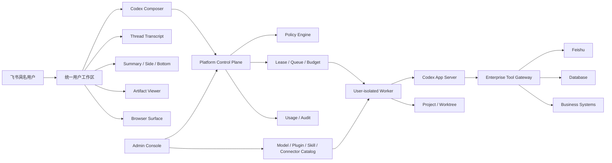

# Codex 全量产品调研与 CodexPlatform 产品策略

> 调研日期：2026-07-27
>
> 调研对象：ChatGPT/Codex 桌面端、Codex CLI、Codex App Server、Codex 企业治理能力
>
> 平台对照：CodexPlatform 1.1A 本机真实纵切
>
> 结论边界：本文描述的是截至调研日可由官方文档、公开协议、用户实机截图或当前代码验证的能力，不把预览、实验接口或规划能力写成稳定交付。

## 1. 执行结论

Codex 已经不是“带终端的聊天机器人”，而是一个由五层能力组成的 Agent 工作操作系统：

1. **连续工作上下文**：Project、Thread、Turn、Item、Goal、Memory。
2. **可干预执行循环**：Plan、推理摘要、命令、Tool、Diff、审批、Steer、Interrupt、Resume。
3. **多工作面宿主**：主对话、Pinned Summary、Side Panel、Bottom Terminal、Browser、文件预览和 Review Pane。
4. **能力扩展系统**：Skills、Plugins、Connectors、MCP、Hooks、Subagents、Computer Use。
5. **运行与治理系统**：模型、Effort、权限 Profile、Sandbox、Worktree、Scheduled、账号、用量和企业策略。

CodexPlatform 不应该做 Codex 的像素级复制。正确策略是：

- **直接借鉴 Codex 的任务交互语法**：连续 Thread、Composer、流式 Item、三类 Panel、Subagent、Diff/Terminal/审批。
- **企业化改造 Codex 的个人能力**：Project、Plugin、Connection、Memory、Scheduled、权限和 Usage 都必须加入飞书身份、组织策略、资源范围和审计。
- **自研企业控制面**：多租户身份、账号池、Worker 隔离、Credential Broker、Tool Gateway、审批策略、业务幂等、成本归集、数据治理和管理后台。

当前 CodexPlatform 已从“静态任务时间线”进入“真实 Codex Thread 工作区”，但仍处于可演示的纵切，而不是可组织推广的工作台。最重要的下一步不是继续增加入口，而是先补齐：

1. 真实 Workspace/权限边界。
2. Artifact、Source、Diff 和 Terminal 的完整闭环。
3. Plugin/Connection 的企业目录与变更治理。
4. Subagent 的真实树、预算和审批继承。
5. 独立 Worker 与用户隔离。

## 2. 证据方法与术语边界

### 2.1 证据等级

| 标签 | 含义 | 可以得出的结论 |
| --- | --- | --- |
| O：官方产品确认 | OpenAI 官方产品页或帮助文档明确描述 | 能力是公开产品设计，但仍需看计划、地区和 Feature Maturity |
| P：公开协议确认 | Codex App Server README/生成 Schema 存在请求、事件或类型 | 可作为宿主集成基础，不代表桌面 UI 已开放，也不代表接口稳定 |
| U：实机观察 | 用户截图或当前本地页面实际可见、可操作 | 能确认当前构建的交互，不自动证明底层协议归属 |
| C：当前代码确认 | CodexPlatform 代码、API、数据库或真实 UAT 验证 | 能确认我们当前已经接入的范围 |
| I：方案推导 | 基于目标和约束提出的平台设计 | 需要后续 PRD、技术设计和验收 |

### 2.2 三类能力必须分开

| 能力层 | 示例 | 对 CodexPlatform 的含义 |
| --- | --- | --- |
| Codex Runtime / App Server | Thread、Turn、Item、模型目录、Plan、命令、Tool、Diff、审批、Subagent 事件 | 可以通过协议适配接入 |
| ChatGPT/Codex 桌面宿主 | Browser、Office 预览、局部批注、Review Pane、窗口/Panel、Computer Use、Chrome 会话 | 需要平台自己提供宿主能力或接入官方 Plugin |
| OpenAI 云端与工作区 | Sites、云端 Scheduled、Workspace 插件目录、组织 RBAC、Compliance API | 不能假定一个共享 CLI 账号就自动拥有，需要独立服务或平台治理 |

“协议有字段”“生成类型存在”“桌面端有界面”“我们已经接入”是四件不同的事。

## 3. Codex 产品能力全景

## 3.1 产品入口与信息架构

### 统一桌面应用

当前桌面产品把 ChatGPT 与 Codex 放进同一个应用壳：

- 顶部产品切换：ChatGPT / Codex。
- ChatGPT 下继续区分 Chat / Work。
- Codex 使用本地或远程开发环境执行长期任务。
- New chat 是主要任务入口；Quick chat 用于轻量即时问题。

这套设计表达的不是三个模型，而是三种工作契约：

| 模式 | 用户预期 | 上下文与工具 | 交付形态 |
| --- | --- | --- | --- |
| Chat | 快速问答、解释、讨论 | 轻工具、文件和网络 | 主要是回答 |
| Work | 长交付物、研究、知识工作 | Hosted Agent、插件、文件、子 Agent | 报告、表格、演示、跨系统任务 |
| Codex | 在工程环境中构建、调试、交付 | 本地/远程目录、命令、Git、Agent Tool | 代码、Diff、命令结果、运行产物 |

### 左侧导航

公开文档和实机界面共同显示以下组织方式：

- New chat。
- Pull requests / Code review。
- Sites。
- Scheduled。
- Plugins。
- Pinned chats。
- 最近对话。
- Projects 与项目内对话。
- Archived chats。
- Settings 与账户入口。

### Project

Codex/ChatGPT 的 Project 不是简单文件夹标签：

- ChatGPT Project 聚合聊天、上传文件、项目 Instructions 和连接来源。
- Local Project 绑定一个或多个本地目录。
- Codex CLI 把启动目录视作当前项目。
- 不同 Thread 分离不同结果，Project 维持共享背景。
- Git 项目可以在 Local、Worktree、Cloud/Remote 环境中执行。

## 3.2 Thread、Turn 与长任务

### Thread

Thread 是长期对话和执行上下文，不是一次任务结果页。公开 App Server 支持：

- `thread/start`：新 Thread。
- `thread/resume`：恢复已有 Thread。
- `thread/fork`：复制历史并分叉。
- `thread/list/read/search`：列表、读取和搜索。
- `thread/archive/unarchive/delete`：生命周期管理。
- `thread/name/set`：命名。
- `thread/goal/set/get/clear`：Goal。
- `thread/compact/start`：上下文压缩。
- `thread/rollback`：回滚 Thread 状态。
- `thread/turns/list`、`thread/items/list`：分页读取历史。
- `parentThreadId` / `ancestorThreadId`：Subagent Thread 树。

### Turn

Turn 是一次用户输入到 Agent 终态的执行：

- `turn/start`。
- `turn/steer`：运行中增加或修改要求。
- `turn/interrupt`：停止当前 Turn。
- `turn/started/completed` 事件。
- Turn 级 Plan、Diff、Token、模型路由和审批。

### Goal 与长任务

桌面端和 CLI 支持 `/goal`：

- 明确目标、约束和完成标准。
- 进度条可暂停、恢复、编辑或清空 Goal。
- 同一 Thread 中继续增加上下文和变更约束。

但 Goal 是 Agent 的任务持续机制，不等于强一致工作流引擎。它不自动保证：

- 进程崩溃后从中断指令位置继续。
- 外部写操作安全自动重试。
- 无人值守跨天运行必然成功。
- 多人同时编辑一个 Thread。

## 3.3 Composer

Codex Composer 是任务控制台，不只是输入框：

- `+`：附件、文件、图像、Skill、Plugin/App、项目来源。
- `@`：明确调用 Plugin、Skill、Browser、Computer Use 或连接器。
- 模型选择。
- Reasoning Effort。
- Speed / Service Tier（依账号和模型开放）。
- 权限模式。
- 语音输入或 Realtime（部分能力为实验）。
- Send / Stop 原位切换。
- 运行中发送内容成为 Steer 或 Queue，行为可在 Settings 配置。

模型目录来自 Runtime：

- `model/list` 返回可用模型、默认模型、隐藏状态。
- 返回模型支持的 Effort，客户端必须保持服务端顺序。
- 还可能包含 Speed Tier、Service Tier、升级提示和可用性说明。
- 模型发生路由时通过 `model/rerouted` 事件告知宿主。

## 3.4 Transcript：主对话流

Transcript 不是“所有流式日志”，而是 Thread 中面向用户的可读执行叙事。它由多种 Item 组成：

| Item | Transcript 中的表达 | 详细内容位置 |
| --- | --- | --- |
| User Message | 用户输入 | 主对话 |
| Agent Message | 解释、阶段结论、最终回答 | 主对话 |
| Reasoning Summary | “执行思路”摘要，可折叠 | 主对话 |
| Plan | 当前步骤和状态 | 主对话摘要 + Summary/Side Panel |
| Command | 命令、状态、耗时、退出码 | 主对话摘要 + Bottom Terminal |
| Tool Call | Tool、状态、结果摘要 | 主对话摘要 + Tool Detail |
| File Change | 修改文件数、摘要 | 主对话摘要 + Review/Diff |
| Approval | 风险、命令/资源、允许范围 | 主对话就地决策 |
| Subagent Activity | Agent 名称、状态和摘要 | 主对话摘要 + Subagents |
| Warning / Reroute / Compact | 运行异常和上下文变化 | 主对话状态行 |
| Result | 本轮结果和验证 | 主对话 |

所以 Transcript 包含流式 Agent 内容，但不等于 Terminal 全量输出、原始 Tool JSON 或原始思维链。

## 3.5 推理展示

Codex 产品展示的是可读 `reasoning.summary`：

- 摘要由模型提供给用户理解方向和进展。
- 原始 reasoning text 与 encrypted content 不应进入产品页面、日志、搜索或审计。
- 推理摘要不是操作证据。
- 审计应依赖 Plan、命令、Tool、Diff、审批和外部回执。

App Server 同时存在 summary delta 和 reasoning text delta 事件，这不代表宿主应该把后者直接展示给用户。

## 3.6 Workspace 的多工作面

### Pinned Summary

- 悬浮在对话上方。
- 聚合当前或最近 Turn 的 Plan、Outputs、Subagents、Browser、Sources。
- 用于快速状态导航，不替代详情。

### Side Panel

- 右侧 Dock。
- 可切换 Plan、Outputs、Subagents、Sources。
- Browser 可作为带 Tab 的工作区。
- Subagent 列表和子 Thread 详情在此展开。
- Diff、Tool、文件详情可以使用详情子视图。

### Bottom Panel

- 位于主对话下方。
- 主要承载 Integrated Terminal。
- Terminal 与当前 Project/Worktree 绑定。
- 用户和 Agent 可以共同读取当前输出。
- 可承载多个终端 Tab。

### Review Pane

- 展示代码 Diff。
- 支持逐行评论。
- 展示 Review Findings。
- 支持 Stage、Revert、Commit、Push。
- `/review` 可以审查未提交修改或相对基线的修改。

### Browser

- 内置独立浏览器 Profile，不自动共享用户日常浏览器会话。
- 可以打开本地预览、网页和多 Tab。
- Agent 可以点击、输入、截图和验证。
- 支持页面元素或区域批注。
- Developer Mode 可在审批后使用 CDP 检查 DOM、样式、Console、Network 和性能。
- Chrome 既有会话由 Chrome Extension 处理，而不是内置 Browser 自动继承。
- 官方明确：Browser 不属于 Codex CLI 或 IDE Extension。

### 文件与 Artifact Viewer

桌面端可以并排预览：

- Markdown 和代码。
- DOCX。
- XLSX。
- PPTX。
- PDF。
- 图片和生成产物。

支持针对段落、表格、图表、幻灯片区域进行局部批注并要求聚焦修改。CLI 只负责创建和编辑文件，不提供可视化预览或批注。

## 3.7 Subagents

### Runtime 行为

- 主 Agent 可以并行创建专用 Agent。
- 每个 Subagent 是独立 Thread。
- 子 Agent 执行自己的模型和 Tool，因此增加 Token 消耗。
- 主 Thread 只接收活动摘要和最终结果，减少上下文污染。
- 子 Agent 继承父任务的 Sandbox、Permission Mode 和可用 Tool。

### 桌面交互

- Pinned Summary 显示 `Subagents · N Working`。
- Subagents 抽屉按 Active / Done 分组并显示数量。
- 行内展示头像、名称、状态、耗时和一行摘要。
- 点击进入独立子 Thread，查看它的可读过程、命令、Tool 和结果。
- 官方桌面/网页面板以只读检查为主；停止或 Steer 通过对主 Agent 发指令完成。
- CLI 用 `/agent` 切换 Agent Thread。

## 3.8 Skills、Plugins、Connectors、MCP 与 Hooks

### Skill

Skill 是“说明 + 资源 + 可选脚本”的工作流包：

- 描述何时使用。
- 固化步骤、质量标准和引用资料。
- 可以携带模板、参考文件和自动化脚本。
- 可以来自用户目录、项目目录或 Plugin。

### Plugin

Plugin 是可分发的能力包，可包含：

- Skills。
- Connector。
- MCP Server。
- Browser Extension。
- Hooks。
- 可选自定义 UI。

桌面端和 CLI 有 Plugin 浏览与安装入口；同一个公共目录服务 ChatGPT Work 与 Codex。安装后通常在新 Thread 生效。

### Connector / App

Connector 负责访问外部系统：

- 使用用户或组织授权。
- 暴露结构化 Tool。
- 可以带 OAuth 和自定义 UI。
- 源系统身份最终决定用户能读写什么。

App Server 的 `app/list` 可列连接器，但部分可访问性与安装链路仍标记 under development。

### MCP

MCP 是工具与资源协议层：

- 定义 Tool、Resource 和 Prompt。
- 承担外部系统调用与结构化结果。
- 可使用 OAuth。
- 可以作为 Connector 或 Plugin 的底层服务。

### Hooks

Hook 是确定性的生命周期脚本，可运行在：

- UserPromptSubmit。
- PreToolUse / PostToolUse。
- PermissionRequest。
- PreCompact / PostCompact。
- SubagentStart / SubagentStop。
- Stop。
- SessionStart / SessionEnd。

普通用户不应任意安装或信任 Hook，因为 Hook 本质上是在宿主机器执行代码，可能读取环境、修改文件、记录 Prompt 或绕过普通 Tool 的审查。Codex 本身会要求基于 Hook 内容哈希进行 Trust Review；企业还可以只允许 Managed Hooks。

## 3.9 Browser、Computer Use 与桌面协作

### Computer Use

Computer Use 是桌面 Plugin，不是裸 CLI 能力：

- macOS 依赖 Screen Recording 和 Accessibility。
- Windows 需要前台可见桌面。
- 可操作浏览器、Excel、PowerPoint 和其他被允许应用。
- 第一次访问应用需要批准，可维护 Always Allowed Apps。
- 官方建议：有专用 Plugin/MCP 时优先结构化接入，只有结构化接口不足时再用 Computer Use。

### Chrome Extension

- 用于既有 Chrome Profile、Tab 和登录态。
- 与内置 Browser 的隔离 Profile 不同。
- 适合必须延续用户浏览器上下文的任务。

### Office

Codex 生成 Office 文件通常依靠：

- Skill 中的模板、规范和验证步骤。
- 脚本/库生成 DOCX、XLSX、PPTX、PDF。
- 文件系统保存产物。
- 桌面 Artifact Viewer 预览与批注。
- Microsoft Office Add-in 或 Computer Use 做 GUI 操作。

App Server 并不存在“创建 PPT 页面”“修改 Excel 单元格”这样的统一原生 Office 对象模型。

## 3.10 开发工作流

- 本地 Project。
- Cloud Environment。
- Remote SSH Environment。
- Worktree 隔离。
- Integrated Terminal。
- Diff 与 Review。
- Git 状态、Stage、Revert、Commit、Push。
- Pull Request 入口和 GitHub 集成。
- `/review`。
- Sites 本地预览与生产部署。
- Appshots：从运行中的应用捕获视觉上下文。
- Browser 注释驱动 UI 修复。
- Fuzzy File Search。
- 文件监听与工作区变化更新。

## 3.11 Scheduled 与远程控制

### Scheduled

- 支持一次性或重复 RRULE。
- 可以使用 Local Project 或专用 Worktree。
- 可指定模型、Effort、Plugin 和 Skill。
- 有 Active、Paused、Completed、Unread Inbox。
- 本地计划任务要求机器和应用保持可运行。
- 无人值守任务必须预先设定权限策略。

### Remote Control

- 可以从手机等连接设备查看运行状态。
- 处理审批。
- 修改模型或发送后续要求。
- App Server 有远程启用、配对、客户端列表和撤销等实验接口。

## 3.12 Memory 与 Chronicle

### Local Memory

- 默认关闭。
- 从符合条件的历史 Thread 异步提取记忆。
- 会跳过活跃、短生命周期或额度过低场景。
- 存于 `$CODEX_HOME/memories/`。
- 可以分别控制“读取已有记忆”和“贡献未来记忆”。
- 外部 Tool/Web 上下文可以配置为不进入记忆。

### Chronicle

- macOS 上周期性截取屏幕上下文。
- 使用后台 Agent 生成本地 Markdown 记忆。
- 截图短期保存在本机，记忆存到 `memories_extensions/chronicle`。
- 能记住用户在不同应用中的工具、流程和工作内容。
- 具有明显的隐私、提示注入和额度风险。

共享账号环境不能直接共享一个 `$CODEX_HOME` Memory。否则用户历史、文件路径、业务信息和行为偏好会串用。

## 3.13 Settings 全景

桌面端设置覆盖：

| 分组 | 典型能力 |
| --- | --- |
| General | 输入行为、Steer/Queue、Prevent Sleep、通知、默认打开方式、Code Review 行为 |
| Profile | 活跃度、Token、连续使用、最长任务、邀请 |
| Appearance | 主题、强调色、UI/代码字体 |
| Voice | 语音和 Realtime |
| Configuration | Runtime 与原始配置入口 |
| Personalization | Personality、Instructions、Suggested Prompts、Memory、Chronicle |
| Pets | 非生产性个性化 |
| Keyboard shortcuts | 搜索、修改和恢复快捷键 |
| Usage & billing | 用量和个人计费 |
| Account | ChatGPT/Codex 账号 |
| Apps / Plugins | 安装、启用、授权和目录 |
| Browser | Profile、下载、网站允许/禁止、Developer Mode |
| Computer Use | 可控制应用、Always Allowed |
| Hooks | 查看和信任生命周期 Hook |
| Connections | MCP 和外部系统 |
| Git | Git 行为 |
| Environments | Local、Cloud、Remote |
| Worktrees | Root、保留数和清理 |
| Archived chats | 归档会话 |

## 3.14 企业治理

Codex 的企业控制面已经明确区分：

- Workspace RBAC 与席位。
- Managed Configuration。
- Requirements：用户不能突破的约束。
- Managed Defaults：启动默认值，用户运行时可调整。
- 模型可用范围。
- Permission Profiles。
- Plugin 可用和安装策略。
- Skill 来源和启用策略。
- Connector Action 与权限策略。
- Analytics 与 Analytics API。
- Compliance API 与审计事件。
- Access Token 与远程环境。

尤其重要的是，Plugin 治理是分层的：

1. Plugin 是否可见/可安装。
2. Plugin 内 Skill 是否启用。
3. Connector 是否可访问。
4. Connector 哪些 Action 可执行。
5. 源系统中用户身份最终能访问什么。

## 4. App Server：可复用能力与宿主缺口

## 4.1 当前公开协议已覆盖

| 协议域 | 代表方法/事件 | 稳定性提示 |
| --- | --- | --- |
| Thread | start/resume/fork/list/read/search/archive/goal/compact/rollback | 核心稳定，部分历史分页和新字段实验 |
| Turn | start/steer/interrupt/plan/diff/completed | 核心 |
| Item | message、reasoning、command、fileChange、MCP、Tool、approval | 核心与部分实验并存 |
| Model | model/list、rerouted、capabilities | 可用于真实模型与 Effort 目录 |
| Permission | permissionProfile/list、approval requests | Permission Profile 为 beta |
| Subagent | parentThreadId、collab agent items、thread filters | 产品已开放，部分字段随版本演进 |
| Terminal/Process | command/exec、process/spawn、write、kill、resize、background terminals | 可构建终端宿主 |
| File | fs read/write/list/copy/remove/watch | 是文件操作协议，不含 Office 预览 |
| Plugins | marketplace、plugin list/read/install/uninstall/share | install/uninstall 标记 under development |
| Apps | app/list/read、MCP OAuth | 一些可访问性链路 under development |
| Account | login、rate limits、usage、workspace messages | 可用于账号与额度 |
| Remote | enable/pair/list/revoke | 实验 |
| Realtime | audio/text/speech/voice/transcript | 实验 |
| Memory | thread memory mode、memory reset | 本地状态，平台仍需处理隔离 |

## 4.2 App Server 不会替平台完成

- 用户端页面与 Panel 布局。
- DOCX/XLSX/PPTX/PDF 渲染。
- 局部批注坐标与文件版本映射。
- Browser Profile 和 Browser Worker。
- Computer Use 桌面权限。
- 飞书身份与企业 RBAC。
- 多租户隔离。
- 账号池公平调度。
- 外部 Tool 的用户身份与数据范围。
- 写操作幂等与补偿。
- 组织成本分摊。
- 企业审计和保留策略。

## 5. CodexPlatform 当前实现审计

## 5.1 已形成真实能力

| 能力 | 当前状态 | 证据 |
| --- | --- | --- |
| 飞书 OAuth | 已接入 | 实际登录和 Session |
| Codex 真实 Runtime | 已接入 | App Server 0.144.6，真实任务完成 |
| 连续 Thread | 已接入 | 多 Turn、SSE 重放 |
| 模型目录 | 已接入 | 实际显示 Sol/Terra/Luna/5.5/5.4 等模型与动态 Effort |
| Transcript | 已接入 | User、Agent、Reasoning Summary、Command、Tool、状态 |
| Stop / Steer | 已接入 | API 与 UI |
| Plan / Diff / Approval | 协议和界面已接入 | UAT 与事件投影 |
| 三个 Panel | 已接入基础版 | Pinned Summary、Side、Bottom 可同时开启 |
| Subagent | 已有列表、详情和事件投影 | 当前仅验证基础展示 |
| 用户 Settings | 已有 General/Profile/Execution/Personalization/Connections/Plugins/Usage/Archived |
| 管理后台 | 已分离 | Accounts、Policies、Connectors、Usage、Audit、Runtime Health |
| 账号与额度 | 已接入单账号 | 0/4、周额度、健康度、排空/隔离/重认证 |
| Tool Gateway | 已接入基础版 | 飞书、Demo DB、Demo Business |
| 审计 | 已接入基础事件 | 用户、账号、Thread、结果 |

## 5.2 产品体验差距

### Workspace 仍是“功能拼装”

- 三个 Panel 可以同时打开，但当前布局会明显遮挡主对话和 Composer。
- Pinned Summary 是居中大浮层，偏离“轻量状态摘要”的用途。
- Side Panel 只有单层 Tab，缺少 Browser、多文件、多详情历史。
- Bottom Panel 是命令输出查看器，不是用户可操作的 Integrated Terminal。
- 缺少 Panel Resize、Tab 管理、窗口恢复和快捷键体系。

### Project 还只是分类

- 没有真实工作目录选择和边界展示。
- 没有 Project Instructions、Sources、成员、默认 Tool/Policy。
- 没有 Local / Worktree / Remote 环境选择。
- 没有分支、Git 状态或工作树状态。

### Artifact 与 Sources 基本空缺

- Composer 明确显示 `Attachments unavailable in 1.1A`。
- Outputs 和 Sources 通常为空。
- 没有文件上传、版本、下载和产物库。
- 没有 DOCX/XLSX/PPTX/PDF 预览。
- 没有文件局部批注。
- Diff 还没有形成 Stage/Revert/Commit/Push 闭环。

### 执行叙事仍不稳定

- 真实 Thread 中存在大量短 Reasoning Summary，部分英文标题对普通员工不友好。
- 运行资源、命令和最终回答之间的层次还不够稳定。
- 缺少 Goal、明确的阶段进度、上下文压缩提示和状态恢复入口。
- 模型和 Effort 已有，但权限模式仍是工程枚举。

## 5.3 最重要的安全缺口

真实 Thread 中，用户询问“如何配置 Plugin”时，Agent 直接执行：

`codex mcp add openaiDeveloperDocs --url https://developers.openai.com/mcp`

这修改了共享 Runtime 的全局 Codex 配置。它揭示了当前权限模型的关键问题：

- 用户任务文件权限和平台管理配置权限未分离。
- Agent 能在普通 Thread 中调用 Codex 管理命令。
- 共享 `$CODEX_HOME` 的 MCP、Plugin、Hook 或 Skill 变更可能影响其他用户。
- 当前 `DEFAULT / READ_ONLY / WORKSPACE_WRITE` 不足以表达企业资源范围。

P0 必须增加：

- 普通用户 Worker 不得写共享 `$CODEX_HOME`。
- 规则或 Managed Hook 禁止普通任务执行 `codex mcp add/remove`、Plugin install/uninstall、Hook trust 等平台管理命令。
- Plugin/MCP 变更只能经管理后台、审批和审计执行。
- 用户项目目录与 Runtime 凭证/配置目录必须操作系统级隔离。
- Permission Profile 要明确文件、网络、Tool、外部写操作和管理动作。

## 5.4 协议“已生成”远大于“已接入”

仓库生成 Schema 已包含大量能力，但当前 Runtime 主动调用主要只有：

- initialize。
- account login / rate limits。
- model/list。
- thread start/resume/memory mode。
- turn start/steer/interrupt。
- background terminals list/terminate/clean。

因此以下能力目前仍不能按“已有类型”算成产品已交付：

- Goal。
- Thread fork/search/pin/rollback。
- Plugin/Marketplace 安装治理。
- App/Connector 目录与 OAuth。
- Permission Profile。
- File Watch。
- Review。
- Remote Control。
- Scheduled。
- Realtime Voice。
- Environment/Worktree。

## 5.5 企业后台仍主要是投影

- Policies 是只读。
- Users/Roles 未接。
- Connectors 中数据库和业务系统仍是 Mock。
- Usage 无法将共享账号额度准确归属个人。
- Worker isolation 显示 `NOT_IMPLEMENTED`。
- Multi-user ready 明确为 `Not ready`。
- Subagent 并发和预算尚无硬执行器。

## 6. 借鉴、改造与自研决策矩阵

## 6.1 直接借鉴

这些是经过 Codex 验证的通用 Agent UX，应尽量保持交互语法一致：

| 能力 | 借鉴方式 |
| --- | --- |
| Project → Thread → Turn → Item | 作为全平台核心信息模型 |
| Composer | 模型、Effort、权限、上下文、Send/Stop/Steer 同区 |
| Transcript | 可读执行叙事，详情渐进展开 |
| Reasoning Summary | 只展示摘要，不展示原始推理 |
| Plan | 当前步骤 + 完成状态 |
| 三个 Workspace Surface | Summary、Side、Bottom 独立可组合 |
| Subagents | Active/Done、独立子 Thread、主 Thread 只汇总 |
| Terminal | 命令 Item 与真实终端 Session 分离 |
| Review Pane | Diff、逐行评论、Stage/Revert/Commit/Push |
| Browser Annotation | 用可见页面状态驱动局部修改 |
| Archive/Pin/Search | 长期 Thread 管理 |
| Model Catalog | Runtime 动态目录，不硬编码 |
| Project/Worktree | 并行任务使用独立文件环境 |

## 6.2 企业化改造

| Codex 原能力 | 企业改造 |
| --- | --- |
| Account | 飞书具名用户与模型账号完全分离 |
| Project | 加入组织、成员、资源范围、数据级别、默认策略 |
| Permission Mode | 改为管理员发布的业务化 Permission Profile |
| Plugin Directory | 管理员批准目录；用户只能启用被批准插件 |
| Connector OAuth | 按飞书用户独立授权，组织控制 Action |
| Skill | 分个人、项目、组织、强制四层来源和优先级 |
| Hooks | 只允许 Managed Hooks 或经过安全评审的项目 Hook |
| Memory | tenant + user + project 隔离，提供查看、删除、导出和保留策略 |
| Scheduled | 服务端可靠调度、幂等、凭证续期、失败告警和人工恢复 |
| Usage | 用户、部门、项目、模型、Tool、Agent 树多维归集 |
| Approval | 风险级别、资源范围、影响预览、一次/本次/永久授权 |
| Sources | 企业来源显示标题、URL、版本、权限主体和引用 |
| Subagent | 继承用户身份和 Policy，按树归集预算与审批 |

## 6.3 必须自研

这些是 Codex 个人产品无法替企业工作台完成的核心壁垒：

1. **Identity Plane**：飞书 SSO、组织、角色、用户状态、离职回收。
2. **Runtime Plane**：独立 Worker、独立工作目录、独立用户状态目录。
3. **Credential Broker**：模型认证与用户身份解耦，账号级串行刷新。
4. **Account Pool**：额度、并发、租约、排队、健康度、排空和恢复。
5. **Enterprise Tool Gateway**：飞书、数据库、业务系统的统一 Tool Schema、鉴权、脱敏和审计。
6. **Policy Engine**：文件、网络、Tool、资源、写操作、审批和数据级别。
7. **Workflow Reliability**：幂等、回执、补偿、人工恢复、跨天任务状态机。
8. **Artifact Service**：文件版本、对象存储、预览、批注、下载和保留。
9. **Browser Worker**：隔离 Profile、网站 Policy、录像/截图、敏感操作审批。
10. **Platform Memory**：隔离、来源、过期、删除、贡献开关和企业知识边界。
11. **Cost & Audit**：按用户/项目/Agent 树归集额度、Token、Tool 和外部资源。
12. **Admin Console**：策略发布、连接器、模型、Plugin、Skill、Worker、异常和审计。

## 6.4 不应照搬

- 不照搬个人账号和个人 Billing。
- 不把 Pets、Voice 等消费功能放进近期企业 P0。
- 不向普通用户开放原始 TOML。
- 不允许普通用户直接安装任意 Plugin、MCP 或 Hook。
- 不复用共享账号的 Native Memory。
- 不使用一个共享 `$CODEX_HOME` 承载多人 Thread 和配置。
- 不把桌面绝对路径和个人 Home 当作企业工作区。
- 不把所有命令日志灌进 Transcript。
- 不追求图标、颜色和尺寸的像素级复制。
- 不把 Sites、Browser、Computer Use 等桌面宿主能力误写成 CLI 原生能力。

## 7. 推荐产品架构

### 用户端

- 飞书登录。
- Project 与 Thread。
- Codex Composer。
- Transcript。
- Summary / Side / Bottom。
- Artifact / Diff / Browser。
- 用户 Settings。
- 个人 Usage、Connections、Archived。

### 管理端

- 用户和角色。
- 账号池与 Worker。
- 模型和预算。
- Permission Profiles。
- Plugin、Skill、Connector 和 MCP 目录。
- Tool 与数据策略。
- 审批策略。
- Scheduled 和异常。
- Usage、Audit、Retention。

## 8. 建议版本路线

## 8.1 1.1.1：先完成可信执行闭环

### P0-1 权限与 Workspace

- Project 必须绑定受控 Workspace Root。
- Worker 无法读取共享凭证、其他用户目录和个人 Home。
- 上线 Permission Profile：只读分析、项目编辑、企业只读、企业写入审批、管理员维护。
- 禁止普通 Thread 修改 Codex 全局配置。
- 所有 Tool 绑定 ActorContext，缺失则 Fail Closed。

### P0-2 Codex 核心体验收敛

- 调整三个 Panel 的尺寸、遮挡和响应式行为。
- Pinned Summary 变为轻量摘要，不覆盖 Composer。
- Bottom Panel 支持多个命令 Session、展开、复制和清理。
- Transcript 统一 Item 语法、中文状态和 Delta 合并。
- 显示请求模型、实际模型、Effort、权限和 Workspace。

### P0-3 Artifact / Source / Diff

- 附件上传。
- Outputs 和 Sources 真实数据模型。
- 文件列表、下载、版本和预览。
- Markdown/PDF 第一批渲染。
- Diff 支持逐文件、逐块和逐行评论。
- Stage/Revert/Commit/Push 进入审批闭环。

### P0-4 Subagent

- 真实父子 Thread 树。
- Active/Done 列表和详情。
- Token、耗时和预算树归集。
- Approval 标明来源 Agent。
- 子 Agent Tool 继承父 ActorContext。

## 8.2 1.2：企业能力市场

- 管理员 Plugin/Skill 目录。
- 用户启用被批准 Plugin。
- MCP Gateway。
- 飞书 Wiki/Doc/Sheet/Base/IM/Task 扩展。
- 数据库只读连接器。
- 业务系统只读连接器。
- Connector 用户 OAuth。
- Tool Action 级权限与审批。

## 8.3 1.3：多模态宿主

- 隔离 Browser Worker。
- 内置页面预览和注释。
- Chrome Connector 的可行性验证。
- DOCX/XLSX/PPTX/PDF 统一 Artifact Viewer。
- Office 文件生成 Skill。
- Computer Use 仅用于没有结构化接口的遗留系统，并设置高风险审批。

## 8.4 1.4：可靠自动化

- Goal。
- Scheduled。
- Notification。
- Worker 重启恢复。
- 外部写操作幂等、回执和人工补偿。
- 远程状态查看和审批。

## 8.5 2.0：统一 AI 工作台

- Chat Runtime。
- Work Runtime。
- Codex Runtime。
- 跨 Runtime Project 与 Artifact。
- Platform Memory。
- 工作流模板市场。
- Sites / Visualizations 等交付物宿主。

## 9. 关键验收场景

### 体验

1. 新用户能从飞书登录直接创建 Thread，并清楚选择 Project、模型、Effort 和权限。
2. 同一 Turn 的 Message Delta 只形成一个连续 Agent 回复。
3. Plan、Command、Tool、Diff、Approval、Subagent 和 Result 层级明确。
4. Summary、Side、Bottom 可同时打开且不遮挡 Composer。
5. 用户能从命令摘要跳到对应 Terminal Session。
6. 用户能从文件修改跳到 Diff，并给出局部评论。
7. 用户能从 `Subagents · N Working` 进入 Active/Done 和子 Thread。

### 安全

1. 普通用户任务不能写共享 `$CODEX_HOME`。
2. 普通用户不能执行 Plugin/MCP/Hook 管理命令。
3. 用户不能通过路径、SSE、Tool Detail、Approval 或 Subagent 访问他人数据。
4. Tool 始终使用飞书用户身份，不使用共享模型账号身份。
5. 外部写操作没有幂等键时不能自动重试。
6. 原始 reasoning 不进入浏览器、数据库、日志和审计。

### 可靠性

1. 浏览器断线后按 Last-Event-ID 重放，不重复副作用。
2. API 重启能恢复 Thread 展示与租约状态。
3. App Server 进程失败后进入明确恢复状态。
4. Stop 同时终止 Turn 和仍在运行的命令/子进程。
5. Scheduled 失败产生告警、回执和人工恢复入口。

### 治理

1. 管理员可以限制模型、Effort、权限、Tool 和 Plugin。
2. 用户只能启用管理员批准的 Plugin。
3. 账号池、用户、Thread、Agent 树、Tool 和外部资源可关联审计。
4. Usage 能按用户、部门、项目、模型和 Agent 树归集。

## 10. 官方资料索引

- ChatGPT/Codex 桌面应用：https://learn.chatgpt.com/docs/app
- Codex App Server：https://github.com/openai/codex/blob/main/codex-rs/app-server/README.md
- Projects：https://learn.chatgpt.com/docs/projects
- Long-running work：https://learn.chatgpt.com/docs/long-running-work
- Browser：https://learn.chatgpt.com/docs/browser
- Computer Use：https://learn.chatgpt.com/docs/computer-use
- Work with files：https://learn.chatgpt.com/docs/artifacts-viewer
- Subagents：https://learn.chatgpt.com/docs/agent-configuration/subagents
- Plugins：https://learn.chatgpt.com/docs/plugins
- Hooks：https://learn.chatgpt.com/docs/hooks
- Memories：https://learn.chatgpt.com/docs/customization/memories
- Chronicle：https://learn.chatgpt.com/docs/customization/chronicle
- Code review：https://learn.chatgpt.com/docs/code-review
- Integrated terminal：https://learn.chatgpt.com/docs/integrated-terminal
- Worktrees：https://learn.chatgpt.com/docs/environments/git-worktrees
- Managed configuration：https://learn.chatgpt.com/docs/enterprise/managed-configuration
- Plugin controls：https://learn.chatgpt.com/docs/enterprise/apps-and-connectors
- Skill controls：https://learn.chatgpt.com/docs/enterprise/skills
- Governance：https://learn.chatgpt.com/docs/enterprise/governance
- Compliance API：https://learn.chatgpt.com/docs/enterprise/compliance-api
- Permissions：https://learn.chatgpt.com/docs/permissions
- Sandboxing：https://learn.chatgpt.com/docs/sandboxing

## 11. 最终判断

Codex 最值得复制的不是黑色界面、左侧栏或卡片样式，而是这套产品原则：

1. **以 Thread 承载长期工作，而不是以表单提交一次任务。**
2. **让 Agent 过程可见，但只展示对用户有用的执行叙事。**
3. **让每类复杂信息进入最适合的工作面，而不是堆在聊天卡片里。**
4. **让用户可以随时 Steer、Stop、Review 和 Approve。**
5. **用 Project、Worktree 和 Permission 约束 Agent 的真实作用域。**
6. **用 Skill、Plugin、Connector 和 Hook 构建能力市场。**
7. **把个人生产力能力与企业治理能力分层。**

CodexPlatform 的差异化不应是“做另一个 Codex”，而应是：

> 保留 Codex 已验证的 Agent 交互，把身份、权限、企业系统、可靠性、成本和审计变成组织级基础设施。
