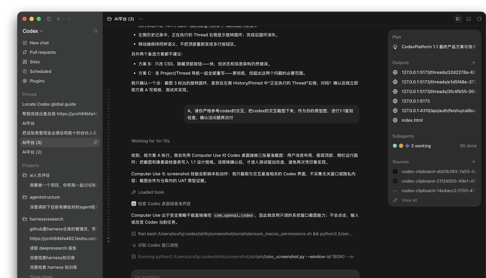
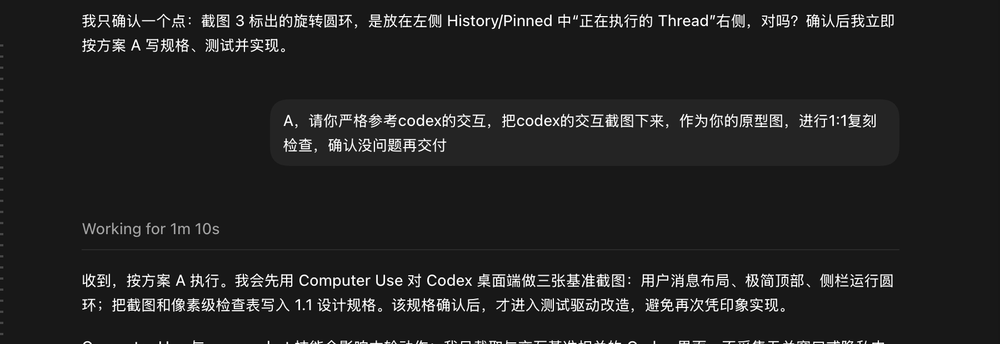
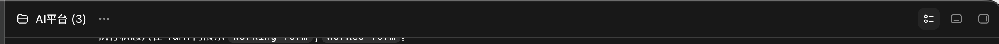
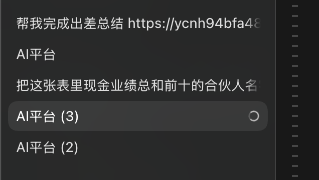

# CodexPlatform 1.1：Codex 顶部、用户消息与运行指示 1:1 对齐设计

日期：2026-07-28

## 1. 目标

本轮只解决三个已被真实页面确认的交互偏差：

1. 普通用户 Prompt 与 Steer 必须像 Codex 一样显示为右侧聊天气泡。
2. Thread 顶部必须采用 Codex 的极简工作区顶栏，不再展示任务运维按钮组。
3. 正在执行的 Thread 必须在左侧历史记录右侧显示旋转圆环，完成后自动消失。

本轮不改变 Runtime、Thread/Turn/Item、SSE、审批、Tool、Subagent、账号调度或权限模型。

## 2. Codex 原型证据

### 2.1 完整运行态

可观察事实：

- 用户输入是靠右气泡，Agent 内容和执行过程靠左。
- 顶部高度紧凑，左侧只有文件夹、当前 Thread 标题与省略号。
- 右侧只有 Pinned Summary、Bottom Panel、Side Panel 三个图标按钮。
- 当前 Turn 的计时和动作位于正文，不进入顶部。
- Composer 在运行时使用圆环和停止方块。
- 左侧当前 Thread 右端显示旋转圆环。

### 2.2 用户消息与 Turn

### 2.3 极简顶部

### 2.4 侧栏运行圆环

## 3. 页面结构

### 3.1 顶部

顶部从“Thread 任务状态栏”改为“Thread 工作区栏”。

左侧固定顺序：

1. 文件夹图标。
2. 当前 Thread 标题。
3. `···` 更多菜单。

右侧固定顺序：

1. Pinned Summary。
2. Bottom Panel。
3. Side Panel。

顶部移除：

- Thread 标题。
- 完成、执行中、失败等状态 Badge。
- `Live / Reconnecting` 文案。
- “停止”大按钮。
- “Archive”大按钮。

能力不删除，只迁移：

- 停止：运行时 Composer 发送按钮切换成白色圆形停止按钮。
- Archive：进入顶部 `···` 菜单。
- SSE 断线：仅在 Composer 上方显示临时紧凑提示；连接正常时不显示。
- Thread 状态：由 Turn 正文和左侧圆环表达。

### 3.2 用户消息

普通 Prompt：

- 右对齐。
- 宽度由内容决定，最大宽度为 Transcript 可用宽度的 72%。
- 背景使用高于页面一级的中性深灰。
- 圆角 16px。
- 水平内边距 16px，垂直内边距 12px。
- 不显示 `YOU` 标签、头像或时间。
- Markdown 保持现有安全渲染规则。

Steer：

- 与普通 Prompt 使用同一个右侧气泡。
- 不再使用左侧紫色竖线。
- 仅在气泡上方以低对比度小字显示 `Steer`，用于区分运行中追加输入。

Agent、Reasoning Summary、Plan、Tool、Command、Approval、Subagent 与最终答案继续左对齐。

### 3.3 左侧运行指示

当 Thread 状态为以下任一值时，在对应历史记录最右侧显示旋转圆环：

- `QUEUED`
- `RUNNING`
- `WAITING_APPROVAL`

`ALLOCATING` remains an internal lease state and is not exposed by the current public `Thread.status` contract.

终态与不可执行状态不显示：

- `DRAFT`
- `READY`
- `COMPLETED`
- `FAILED`
- `INTERRUPTED`
- `NEEDS_RECOVERY`

圆环规则：

- 视觉直径 14px。
- 1.5px 中灰轨道和高亮弧段。
- 旋转周期约 900ms。
- 不改变标题宽度；标题继续单行省略。
- 使用 `aria-label="正在执行"`，并避免仅依靠动画表达状态。

## 4. 组件调整

### `UserSidebar`

- 抽取 `ThreadNavItem`。
- 根据 Thread 状态投影 `active`。
- 渲染标题和右侧运行圆环。

### `ThreadPage`

- 顶部改为 `WorkspaceHeader`。
- 把 Archive 迁入 `WorkspaceHeader` 更多菜单。
- 把 Interrupt 传给 Composer。

### `Transcript`

- 普通 Prompt 和 Steer 继续复用同一 Row 类型。
- 用语义 class 区分 `prompt` 与 `steer`，但两者统一右对齐。

### `Composer`

- 运行中且输入框为空时，发送按钮变为停止按钮并调用既有 `interrupt`。
- 运行中且输入框有内容时，按钮恢复为发送箭头并提交 Steer。
- 不新增 API。

## 5. 响应式规则

- 宽屏顶栏高度为 48px。
- 窄屏保持单行，不再切换成纵向多行按钮区。
- 窄屏对 Thread 标题执行单行省略，并保留三个 Panel 图标。
- 用户气泡在窄屏最大宽度提高到 88%，仍保持右对齐。

## 6. 测试与 1:1 检查

### 自动测试

1. 普通 Prompt 位于带 `data-message-side="right"` 的气泡中，且不出现 `You`。
2. Steer 位于右侧气泡，并显示低对比度 `Steer` 标签。
3. 顶部不出现 Thread 状态、Live、停止和 Archive 大按钮。
4. 顶部只存在三个 Panel toggle。
5. Archive 存在于更多菜单。
6. 运行中的 Thread 导航项显示运行圆环；完成态不显示。
7. 运行时 Composer 显示停止按钮并调用 Interrupt。
8. 1280px 与移动端 Playwright 截图不出现顶部换行或正文遮挡。

### 人工截图对照

交付前并排检查 Codex 原型与 CodexPlatform：

| 检查项 | Codex 基准 | CodexPlatform 通过条件 |
| --- | --- | --- |
| 用户输入 | 右侧深灰气泡 | 方向、最大宽度、圆角和留白一致 |
| 顶部 | 项目级、单行、无状态文案 | 结构和控制数量一致 |
| 运行指示 | 左侧 Thread 右端圆环 | 位置、尺寸和状态切换一致 |
| Turn 状态 | 正文 `Working for…` | 不重复到顶部 |
| 停止 | Composer 白色圆形方块 | 不在顶部显示大按钮 |

必须保存 CodexPlatform 完成后的同尺寸截图，并在 UAT 文档中逐项记录差异；存在结构性差异不得交付。

## 7. 非目标

- 不复制 Codex 的商标、图标素材或专有资源。
- 不在本轮重写完整左侧信息架构。
- 不改变管理后台。
- 不修改服务端任务状态机。
- 不把像素接近误写成协议能力一致。
